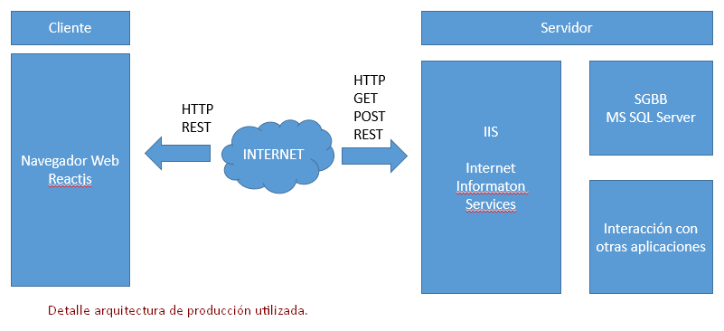

#Acercamiento a Node.js
##¿Qué es Node.js?

Inicialmente es una librería y un entorno de ejecución de entrada y salida, dirigida por eventos, asíncrona que se ejecuta con el intérprete de JavaScript "V8" creado por Google. Además fue la primera librería basasda en JavaScript y con un gran rendimiento.

En pocas palabras, **[Node.js][webNode]** es un runtime multiplataforma de JavaScript, que ha cogido mucha fuerza gracias a su [versatilidad] y al auge de JavaScript. El motivo de nuestro interés en él, se centra en el hecho de haber múltiples utilidades o scripts hechos (a partir de ahora los llamaremos módulos) que nos ayudarán a poder trabajar y automatizar tareas, pudiendo crear aplicaciones orientadas a las redes de comunicación, interactuar con componentes del sistema operativo a través de funciones que cumplen con el estándar **POSIX**.

> **POSIX**, norma escrita por la **IEEE** _(Institute of Electrical and Electronics Engineers)_, definiendo una interfaz estándar del sistema operativo y el entorno, incluyeno un intérprete de comandos (o "shell") así como programas de utilidades comunes para apoyar la portabilidad de las aplicaciones a nivel de código fuente *(fuente: Wikipedia)*.

Define las interfaces y el entorno, utilidades comunes que un sistema operativo puede soportar y hacerlos disponibles para que el código fuente de un programa sea compilable y ejecutable.

Además de ejecutar scripts, posee un gestor de paquetes denominado [npm] que lo usaremos reiteradamente a lo largo de nuestro proceso de desarrollo.

Durante la edición del presente documento, la versión con la que trabajaremos será la **4.4.4 [LTS][enLTS]** que es la que se recomienda en la página oficial.

>**LTS:** son las abreviaturas de *"Long Term Support"* (soporte a largo plazo) utilizadas para indicar que una versión o edición de un software tendrá soporte (actualizaciones, correción de errores) durante un período de tiempo *(fuente: Wikipedia).*

Podemos acceder a la amplia documentación de la [API 4.4.4 LTS][docApiNode].

##Características de Node.js
Para conocer las características que tiene Node.js por defecto (sin requerir indicadores de tiempo de ejecución) clicar [aquí][linkECMAScript].  

##ECMAScript en Node.js
Recordemos que Node.js está contruido sobre la versión del motor de renderización de Chrome V8. Para estar al día con las últimas actualizaciones de este motor, se debe asegurar que las nuevas características de la especificación de **"JavaScript ECMA-262"** es presentada a los desarrolladores de Node.js en tiempo y forma, así como las contínuas mejoras de rendimiento y estabilidad.

>**ECMAScript:** es una especificación de lenguaje de programación. Define un lenguaje de tipos dinámicos inspirado en Java y otros lenguajes del estilo de "C". Soporta algunas características de la programación orientada a objetos mediante objetos basados en prototipos y pseudoclases. Los navegadores web incluyen una implementación del ECMAScript.  

###Uso que le daremos a Node.js
Lo utilizaremos como entorno de desarrollo de nuestra aplicación 

Para producción dispondremos de un servidor con Internet Information Services (IIS) donde alojaremos la página, usaremos Reactjs como framework para el front-end y mediante los paquetes de Node que tendremos instalados previamente

##Arquitecturas utilizadas
###Arquitectura de desarrollo

###Arquitectura de producción

***
##Gestor de paquetes "npm"
**"npm"** facilita a los desarrolladores de JavaScript compartir , reutilizar código así como actualizar el código que se está compartiendo.  

Estas porciones de código reutilizable, llamados **paquetes** aunque  normalmente los llaman módulos. Un **paquete** es un directorio el cual contiene uno más archivos, también hay un fichero **package.json** con meta datos de dicho paquete. En una apliación típica, como en el caso de una página web dependen de docenas o cientos de paquetes. Dichos paquetes son a menudo pequeños. La idea principal es que creemos un bloque que resuelva un problema y lo resuelva bien. Esto hace posible realizar composiciones largas, personalizar soluciones a la medida de estos bloques compartidos.   

Esto permite que su equipo aproveche los conocimientos de otros desarrolladores externos a la empresa incorporando las soluciones de estos a su proyecto e incluso la reutilización de código a través de proyectos.  

En la web oficial de **"[npm]"** podemos encontrar diferentes paquetes o módulos para Node.js, inicialmente **"npm"** comenzó como gestor de Node.js.  

**"npm"** dispone de una página web que contiene multitud de paquetes registrados, es también una base de datos con información sobre los paquetes o módulos que otros desarrolladores comparten. Mediante la instalación del ++"cliente npm"++ el desarrollador lo utilizará para publicar su código en dicho registro de la base de datos, cuando aparezca la entrada de dicho paquete, otros desarrolladores utilizarán su "cliente npm" para instalar el paquete del registro. 

##¿Usar "bower" o "npm"?
Ambos son gestores, pero nuestra opción es **"npm"** porque es el más utilizado para gestionar los módulos para Node.js trabajando en front-end como en el back-end cuando se combina con otros paquetes (por ejemplo: browserify), mientras que **"Bower"** sólo es para el "front-end". 

Referente al árbol de dependencias **"npm"** tiene un árbol de dependencias (de gran tamaño) mientras que **["Bower"][webBower]** sólo require un árbol de dependencias plana ya que pone la carga de la resolución de dependencias en el usuario.  

Más información **[aquí][bowerVSnpm]**.
##Referencias
+ [Página oficial npm](https://docs.npmjs.com/getting-started/what-is-npm).
+ [Página oficial Node.js](https://nodejs.org/en/).
+ [Node.js en GitHub](https://github.com/nodejs/nodejs.org).
+ [ECMAScript2015 (ES6) in Node.js](https://nodejs.org/en/docs/es6/).
+ [Standar ECMA-262 - *ECMAScript 2015 Language Specification*](http://www.ecma-international.org/publications/standards/Ecma-262.htm).
+ [Soporte a largo plazo - LTS Node.js](https://github.com/nodejs/LTS#lts_schedule).
+ [Documentación Node.js 4.4.0 LTS](https://nodejs.org/dist/latest-v4.x/docs/api/).
+ [A Case-by-Case Tutorial Node.js](https://www.toptal.com/nodejs/why-the-hell-would-i-use-node-js).
+ [Tutorial Node.js](http://www.tutorialspoint.com/nodejs).

<!--  Referencias y enlaces a las fuentes -->
[webNode]:https://nodejs.org/en/
[versatilidad]:http://www.nodehispano.com/2011/11/que-es-node-js-nodejs/
[npm]:https://www.npmjs.com/
[enLTS]:https://github.com/nodejs/LTS#lts_schedule
[linkECMAScript]:https://nodejs.org/en/docs/es6/
[docApiNode]:https://nodejs.org/dist/latest-v4.x/docs/api/
[bowerVSnpm]:http://stackoverflow.com/questions/18641899/what-is-the-difference-between-bower-and-npm
[webBower]:https://www.npmjs.com/package/bower