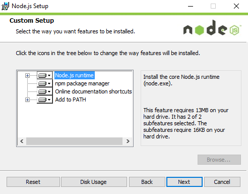
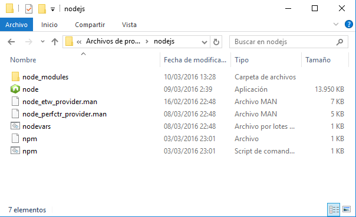
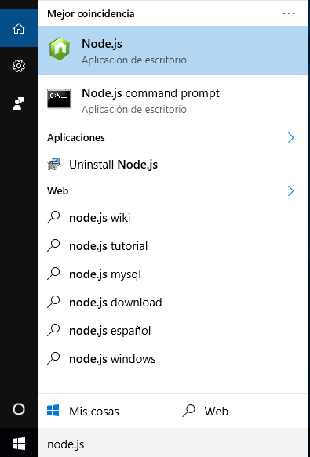
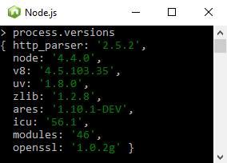
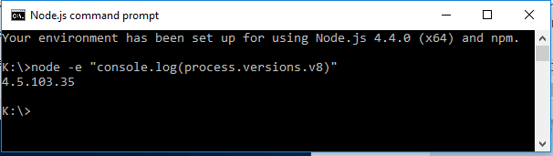

#Instalación
##Instalando Node.js en Microsoft Windows 7/10
La instalación de No​de.js es muy sencilla, aun así, existen múltiples páginas [[1]][enlace1] donde lo explica en castellano.

Nos descargaremos en nuestro caso será la **versión 4.4.0 LTS** que es la que se recomienda para la mayoría de usuarios.  

Nos descargaremos el paquete ejecutable MSI **"node-vx.x.0-x64.msi"** y lo instalaremos en nuestro equipo. Seguiremos los pasos del asistente.

Aceptaremos los términos y condiciones. He indicaremos la ruta de instalación.

Después indicaremos si queremos instalar por completo o no los componentes en forma local. En total unos 30MB.



Las características que tenemos son:
* Instalación del "core Node.js" runtime.
* El gestor de paquetes "npm".
* Links de acceso a la documentación de Node.js en la nube.
* Añadir tanto Node.js como el gestor de paquetes "npm"  y los módulos como variables de entorno del PATH. 


Una vez confirmado los cambios y continuando con la instalación, el asistente habrá finalizado. Ahora, dentro de la carpeta "nodejs" los siguientes archivos:



##¿Qué nos interesa?
+ **nodevars.bat:** entorno de ejecución de node.js, configura el intérprete de comandos de Windows (cmd.exe) con la configuración correcta para la ejecución de node.js. A él se accede con un acceso directo mediante el siguiente comando de ejecución:  
```
C:\Windows\System32\cmd.exe /k "C:\Program Files\nodejs\nodevars.bat"
```  

+ **Node.exe:** conocido como REPL (Read-Eval-Print Loop), consola del runtime que responde a comandos JavaScript. Nos permite obtener información del sistema y hacer pequeñas pruebas sin hacer falta realizar el módulo completo (programa node.js).
+ Carpeta **"node_modules":** aquí encontraremos la carpeta de "npm" así como sus librerías, documentos en html o en Markdown para revisar por el usuario sin necesidad de conexión, etc.

##Buscar "Node.js" con Cortana:
  

Cortana nos mostrará como mejor coincidencia:

* **"Node.js":** es un acceso directo al PERL
* **"Node.js command prompt":** entorno de ejecución de node.js.

##Comprobando el funcionamiento

Para ello buscaremos la versión instalada y el [motor de procesamiento de JavaScript](https://es.wikipedia.org/wiki/V8_%28motor_JavaScript%29 "") que estamos ejecutando.  

1. **Usando Perl: ejecutaremos el comando:** ```> process.versions```  
  
En la imagen podremos ver que la propiedad V8 nos indica el motor de procesamiento de JavaScript.  
Para salir de PERL tenemos que pulsar simultáneamente "CTRL+D", también dos veces "CTRL+C" o bien cerrar la ventana.  
> **Perl:** *"Practical Extracting and Reporting Languaje"* es un lenguaje de programación de script.
> Está basado en un estilo de bloques como en "C" siendo ampliamente adoptado por su destreza en el procesado de texto y no tener ninguna limitación como lenguaje de script *(fuente: Wikipedia)*.

2. **Usando el entorno de ejecución.**  
Una vez dentro, ejecutamos el comando```> node -e "console.log(process.versions.v8)"```  

   
Mediante esta opción hemos ido directamente a la versión del motor.  
**Para poder trabajar con node.js, ejecutaremos "Node.js command prompt".**  
Para salir del prompt, podemos escribir "exit" o cerrar la ventana.
>**Prompt:** carácter o conjunto de carácteres que se muestran en una línea de comandos para indicar que se está a la espera de órdenes *(fuente: Wikipedia)*. 

##Referencias
+ [Descargar Node.js](https://nodejs.org/en/download/)  
+ [Qué es Node.js](1_what_is_node.md)  
+ [Página oficinal de Node.js](https://nodejs.org/en/)
+ [Otras versiones descargables de Node.js](https://nodejs.org/en/download/releases/)

<!-- Referencias y enlaces -->
[enlace1]:http://www.desarrolloweb.com/articulos/instalar-node-js.html