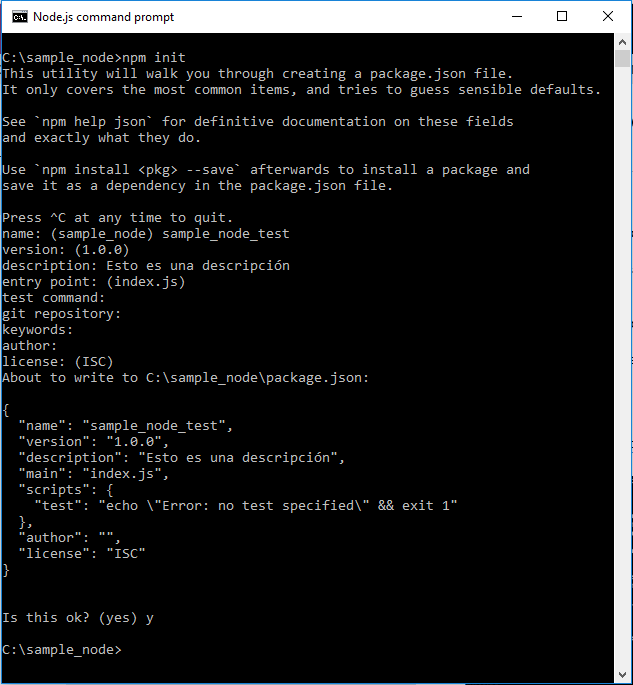

#Nuestro primer proyecto con Node.js
##Introducción a los paquetes npm
**A. Crearemos un proyecto.**
   1. Crearemos la carpeta "sample_node" en el directorio raíz por ejemplo.
   2. Nos situaremos en dicha carpeta o "ruta de desarrollo".
   3. Ejecutaremos el comando `> npm init`.
   4. En principio pondremos el nombre del proyecto.
   5. Contestaremos al resto de preguntas si se cree oportuno.  



Al ejecutar dicho comando se generará el archivo **package.json** con los datos que hemos introducido a las respuestas que se nos han planteado. A parte de los datos del proyecto, dispondrá también el árbol de módulos que se han instalado para el proyecto y así poder recrearlo en caso necesario.  

La estructura del fichero JSON generado es el siguiente:
```json
{
  "name": "sample_node_test",
  "version": "1.0.0",
  "description": "Esto es una descripción",
  "main": "index.js",
  "scripts": {
    "test": "echo \"Error: no test specified\" && exit 1"
  },
  "author": "",
  "license": "ISC"
}
```
> Partimos del fichero sin dependencias hacia módulos **"npm"** ni otros módulos guardados localmente dentro de nuestro proyecto (devDependencies).
 
**B. Instalación de los módulos.**

El siguiente paso es descargarse los módulos necesarios para nuestro proyecto. Veremos lo que ocurre cuando se bajan los módulos y cómo responde el archivo package.json.  
Cada vez que se instala un módulo se descarga en el directorio **"node_modules"** ubicado en el mismo directorio que esta el **package.json**. Este directorio se crea junto a la primera instalación de un módulo.

>ATENCIÓN: En el caso de utilizar un repositorio de código, dicha carpeta nunca se debe de incorporar. Hay que tener en cuenta que al disponer package.json al ejecutar nuevamente **"npm init"**, se procederá a volver a bajar todos los módulos que nos descargamos en su día.  

La sintaxis general para la instalación de módulos es:
`> npm install --save-dev -g <nombreDelModulo>`

|Parámetro   	|Descripción   	|
|---	|---	|
|- -save   	|Para que se quede registrado en el archivo package.json y así poder regenerarlo posteriormente. Es decir, si copiamos el fichero "package.json" y lo ponemos en otra carpeta distintay ejecutamos `> npm install` los paquetes que figuran nos los descargamos localmente sin comprobar dependencias.  	|
| | **Ejemplo:** `npm install --save <nombreDelMódulo>`|
|-dev   	|Es opcional. Obtenemos los paquetes necesarios en tiempo de compilación. Los registra en el archivo package.json en la propiedad "devDependencies", en caso de no poner esta opción lo registra en la propiedad "dependencies". El no poner la opción, evita bajar paquetes inncesarios que cargan el proyecto y ralentizan los procesos. Con la opción "-dev" baja al sistema de archivo todas sus dependencias (pudiendo ser muchas).   	|
| | **Ejemplo:** `> npm install --save-dev <nombreDelMódulo>` |
|-g   	|Instalación global. El módulo se instala en la carpeta destinada a la configuración global del usuario.   	|
| | **Ejemplo:** `> npm install -g <nombreDelMódulo>`|

Por el contrario si nos situamos la carpeta de nuestro proyecto de prueba y ejecutamos el `> npm install -g` podremos comprobar que en la ruta ***"C:\Usuarios\nom_usuario\AppData\Roaming\npm"*** se habrá creado la carpeta **"node_modules"** y dentro la carpeta de nuestro proyecto *"sample_node_test"* que contendrá el fichero JSON pero con mayor contenido:

```json
{
  "name": "sample_node_test",
  "version": "1.0.0",
  "description": "Esto es una descripción",
  "main": "index.js",
  "scripts": {
    "test": "echo \"Error: no test specified\" && exit 1"
  },
  "author": "",
  "license": "ISC",
  "readme": "ERROR: No README data found!",
  "_id": "sample_node_test@1.0.0",
  "_shasum": "7c110228bf930a160a4492f57a5a23644251c8f6",
  "_from": "..\\..\\..\\..\\..\\sample_node",
  "_resolved": "file:..\\..\\..\\..\\..\\sample_node"
}
```
Podemos observar que se ha añadido:  

- "_id" identificador: nombre del directorio o repositorio y la versión.  
- "_shasum": es la firma de verificación utilizada por NodeJS. 
- "_from": ruta donde se encuentra el repositorio o carpeta de nuestro primer proyecto.
- "_resolved": ruta donde se guarda la solución del proyecto. 

En el caso de que queramos instalar nuevos paquetes para nuestro proyecto, se almacenarán en la ruta `C:\sample_node\node_modules\[nombrePaquete]` estando disponibles para utilizarlos. Es posible que nos aparezcan unos avisos ("warnings") indicando que "npm" no encuentra los ficheros "README.md" y la ruta del repositorio dentro del fichero "package.json"

**C. Ejemplo de "package.json".**

En el siguiente ejemplo disponemos 
```json
{
  "name": "reactprueba_sample",
  "version": "1.0.0",
  "description": "prueba react en visual studio",
  "main": "index.js",
  "scripts": {
    "test": "echo \"Error: no test specified\" && exit 1"
  },
  "author": "",
  "license": "ISC",
  "devDependencies": {
    "babelify": "^7.2.0",
    "browserify": "^13.0.0",
    "gulp": "^3.9.1",
    "gulp-concat": "^2.6.0",
    "gulp-webserver": "^0.9.1",
    "reactify": "^1.1.1",
    "vinyl-source-stream": "^1.1.0",
    "watchify": "^3.7.0"
  },
  "dependencies": {
    "jquery": "^2.2.1",
    "react": "^0.14.7",
    "react-router": "^2.0.1"
  }
}
```
>A diferencia del JSON creado por primera vez, en este caso de ejemplo tenemos **"devDependencies"** aparecen los módulos de **"npm"** que se han instalado localmente y son utilizados para desarrollar pero obteniendo los paquetes necesarios en tiempo de ejecución dentro de nuestro proyecto en **"\node_modules"** y en **"dependencies"** los que se usan de forma local pero sin comprobar dependencias siendo necesarios para que funcione nuestra aplicación.  


En el caso de que copiemos y peguemos el fichero **"package.json"** en otra carpeta u otro proyecto y desde el prompt de node.js ejecutemos `> npm install` lo que hará "npm" será a partir de la información que sustraiga del fichero JSON, descargará los paquetes que figuren en ambos [tipos de dependencias][enlaceDependencias].

---
Referencias:  
+ [Introducción a npm](http://www.nodehispano.com/2012/04/una-introduccion-a-npm-nodejs/)
+ [Creando módulos con Node.js](http://www.nodehispano.com/2012/02/creando-modulos-con-node-js-nodejs/)
+ [Video sobre una sesión del Codemotion Madrid 2014](https://www.youtube.com/embed/AkVh0-Thoew)  sobre una introducción de Node.js, con ejemplos de distintos módulos que se pueden usar. 
+ [Página oficial "npm" sobre "package.json"](https://docs.npmjs.com/files/package.json) explicando los diferentes usos de dicho fichero.
+ [¿Cómo diferenciar entre "devDependencies" y "dependencies"?](http://stackoverflow.com/questions/18875674/whats-the-difference-between-dependencies-devdependencies-and-peerdependencies)

<!-- Referencias ocultas -->
[enlaceDependencias]:http://stackoverflow.com/questions/18875674/whats-the-difference-between-dependencies-devdependencies-and-peerdependencies
