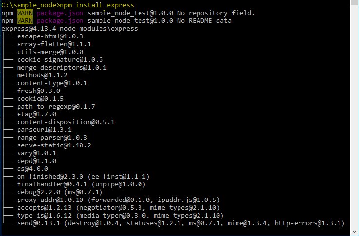
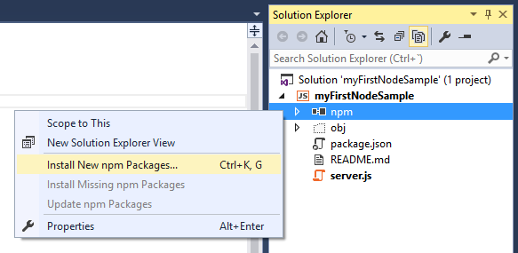

#Módulos para Node.js
##Instalación

Existen dos tipos de instalaciones en Node.js:
+ Módulos necesarios para Tiempo de Compilación.
+ Módulos necesarios para Tiempo de Ejecución.

La diferencia radica en el momento que se van a necesitar/usar los módulos.  
Ejemplos de uso según el tipo de módulos:
+ Tiempo de Compilación, para aquellos que ayuden a:
    + Realizar tareas de factorizar.
    + Mover archivos.
    + Desplegar la aplicación.
+ Tiempo de Ejecución, por ejemplo:
    + Las librerías de JavaScript de uso en la misma aplicación.

>Hay que tener en cuenta que es posible que nos interese realizar una instalación con un ámbito global, con lo cual conseguimos disponer una herramienta en línea de comandos independientemente donde estamos trabajando (tengamos en cuenta que debemos usar el prompt de node.js).  

La sintaxis de instalación es la siguiente:

- Módulos para Tiempo de Compilación:`> npm install --save -dev [nombreDelModulo]`

- Módulos para Tiempo de Ejecución: `> npm install --save [nombreDelModulo]`

- Módulos como herramienta global: `> npm install -g [nombreDelModulo]`

> **Por lo que se refiere a [nombreDelModulo]**, si el módulo está en...
> - nuestro sistema de archivos, deberemos poner la ubicación del mismo.
> - el repositorio de paquetes **npm**, sólo hay que poner el nombre.
> - GitHub, se tiene que poner la dirección precedida de la palabra "git:" (formato del protocolo).

**Ejemplo básico: Instalando el paquete** **"expres":**

>Para ello la sintaxis utilizada es la siguiente:`> npm install express`

>Nos mostrará la versión, y qué elementos lo integran. Además se creará en nuestro ejemplo de proyecto, la carpeta "node_modules" dentro de la cuál encontraremos la carpeta correspondiente a nuestro módulo "express" que hemos instalado de forma local, si hubiéramos utilizado el comando **"-g"** se hubiera guardado en la ruta por defecto establecida en la configuración global, para así utilizar dicho módulo como herramienta desde cualquier módulo.  

>

**Ejemplo usando GitHub:**

>La sintaxis sería la siguiente `> npm install git://github.com/../aitex-js.git` deberemos tener instalado en nuestro sistema "GitHub Desktop" para poder utilizar el shell de Git y poder descargarnos localmente el paquete dentro de nuestro proyecto de ejemplo.

**Ejemplo en Visual Studio:**  

>Una vez creado nuestro proyecto, iremos a "npm" y mediante el menú contextual indicaremos **"la instalación de nuevos paquetes"** (o pulsando la combinación de teclas **"CTRL+K, G"**), acto seguido se procederá a descargar (si es por primera vez, alrededor de 145 MB) o actualizar la lista con la información de los paquetes existentes y actualizar la base de datos para mostrarnos los paquetes o módulos disponibles.

>

>Buscaremos el paquete que deseemos y los instalaremos simplemente clicando. Después podremos ver en el desplegable del proyecto, más concretamente en **"npm"** que se ha añadido dicho paquete.

>Además podemos ejecutar tareas para ciertos módulos que podemos tener instalados desde la ventana **"Task Runner Explorer"**.

---
Referencias:  
+ [Repositorio npm](https://www.npmjs.com/)
+ [Utilidad de Visual Studio Task Runner Explorer](http://webtooling.visualstudio.com/task-runners/)
+ [Como trabajar con node.js desde Visual Studio 2012](https://blogs.msdn.microsoft.com/esmsdn/2014/09/11/cmo-desarrollar-aplicaciones-de-node-js-en-visual-studio/)
