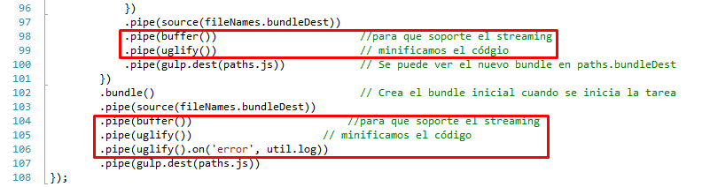

#Fichero "gulpfile.js"

##Uso de los modulos de Node.js en un fichero "gulpfile.js"
Podemos encontrar diferentes formas de crear el fichero "gulpfile.js" en Internet, aquí proporcionamos el que utilizaremos para nuestro/-s proyecto/-s:

```javascript
//Módulos requeridos 
var gulp = require('gulp'); 
var source = require('vinyl-source-stream');    // Se utiliza para transmitir paquete para su  
                                              // posterior manipulación 
var browserify = require('browserify'); 
var reactify = require('reactify'); 
var watchify = require('watchify'); 
var babelify = require('babelify');
var concat = require('gulp-concat'); 
var webserver = require('gulp-webserver');      // Por si queremos ejecutar nuestro propio servidor. 
var project = require('./project.json');        // Lectura del json del proyecto. 

var uglify = require('gulp-uglify');        // Minifica el código
var util = require('gulp-util');            // Mostrar mensajes de error al minificar el código
var buffer = require('vinyl-buffer');       // Soportar Streaming

var plumber = require('gulp-plumber');
var rename = require('gulp-rename');
var cleanCss = require('gulp-clean-css');
var csslint = require('gulp-csslint');

//Nombre de los archivos claves 
var fileNames = {}; 
fileNames.entrySource = "index.js";
fileNames.bundleDest = "main.js"; 

//Rutas 
var paths = { 
    webroot: "./" + project.webroot + "/"       // Propiedad del json. 
}; 

paths.js = paths.webroot + "js/"; 
paths.jsFiler = paths.js + "**/*.js"; 
paths.minJsFilter = paths.js + "**/*.min.js"; 
paths.cssFilter = paths.webroot + "css/**/*.css";
paths.minCssFilter = paths.webroot + "css/**/*.min.css"; 
paths.concatJsDest = paths.js + "site.min.js"; 
paths.concatCssDest = paths.webroot + "css/site.min.css"; 
paths.entrySource = "./site/js/" + fileNames.entrySource;

//paths.entrySourceCss = "./site/css/" +; 
paths.bundleDest = paths.js + fileNames.bundleDest; 

var contador = 0;
var trans = 1; //contador para las veces que se transforma el bundler

//console.log("el cssFilter => " + paths.cssFilter);
//console.log("el minCssFilter => " + paths.minCssFilter);


//Definición de la Tarea 
gulp.task('browserify', function () {
    console.log('Se verifica la lectura de la variable paths.webroot:' + paths.webroot);
    console.log('Empezando con la tarea browserify'); 
    console.log('Creación del bundle usando babel con punto de partida ' + paths.entrySource); 
    var bundler = browserify({
        entries: [paths.entrySource],                   // Solo necesitamos el archivo inicial para encontrar dependencias. 
        transform: [reactify],
        transform: [[babelify, { "presets": ["es2015", "react"] }]],
        //transform: [babelify],                          // Queremos convertir JSX a EMACScript 5.0
        debug: true,                                    // Nos da sourcemapping 
        cache: {}, packageCache: {},
        fullPaths: true                                 // Reserva la ruta original con la que se generó. 
    });

    console.log('Preparando para que se quede observando los cambios.'); 
    var watcher = watchify(bundler); 
    return watcher
        .on('update', function () {                     // Cuando se modifique algún archivo 
            console.log('Actualización de Archivo detectada.');
            var updateStart = Date.now();

            console.log('Actualizando bundle', (Date.now() - updateStart) + ' ms...' + 'guardado(' + contador + ')');
            contador++;
            return watcher.bundle()                 // Crea un nuevo bundle (como se lo hemos pasado por parámetro ya tiene la configuración) 
            // Logs errors
            .on('success', function () {
                console.log("Actualización realizada!!!");
            })
            .on('error', function (err) {
                console.log(err.message + ' error en el bundle ');
                this.emit('end');
            })
            //TODO: revisar xq no muestra el mensaje de finalización.
            .on('finish', function () {
                console.log('Finalizado con o sin errores el bundle!', (Date.now() - updateStart) + 'ms - ' + paths.bundleDest);
                this.emit('end');
            })
            .pipe(source(fileNames.bundleDest))
            .pipe(buffer())                       // para que soporte el streaming
            .pipe(uglify())                       // minificamos el código
            .pipe(gulp.dest(paths.js))            // Se puede ver el nuevo bundle en paths.bundleDest 
        })
        .bundle()                                 // Crea el bundle inicial cuando se inicia la tarea 
        .pipe(source(fileNames.bundleDest))
        .pipe(buffer())                         // para que soporte el streaming
        .pipe(uglify())                         // minificamos el código
        .pipe(uglify().on('error', util.log))   // mostrar mensajes de error
        .pipe(gulp.dest(paths.js))
}); 


//Si falla algún módulo, si ejecutamos la tarea browserify no nos muestra el error. 
gulp.task('build', function () { 
    browserify({ 
        entries: [paths.entrySource],                   // Solo necesitamos el archivo inicial para encontrar dependencias. 
        transform: [reactify],
                                                      // Queremos convertir JSX a EMACScript 5.0 
        transform: [[babelify, { "presets": ["es2015", "react"] }]],
        debug: true,                                    // Nos da sourcemapping 
        cache: {}, packageCache: {}, 
        fullPaths: true                                 // Reserva la ruta original con la que se generó. 
    }) 
    .bundle() 
    .pipe(source(fileNames.bundleDest)) 
    .pipe(gulp.dest(paths.js)); 
}) 

//Iniciamos un server para ver la web, es innecesario pues solo estamos viendo html+js 
gulp.task('server', function () { 
    gulp.src(paths.webroot) 
    .pipe( 
        webserver({ 
            host: '127.0.0.1',                          // equivale a localhost 
            port: 8081,                                 // ojo en tener el puesto libre, en caso contrario saldrá un error EACCES 
            fallback: 'index.html', 
            livereload: true, 
        }) 
    ) 
})

gulp.task('css', function () {
    gulp.src(['site/css/*.css'])
		.pipe(plumber({
		    handleError: function (err) {
		        console.log(err);
		        this.emit('end');
		    }
		}))
		.pipe(csslint())
		.pipe(csslint.reporter())
		.pipe(concat('main.css'))
		.pipe(gulp.dest('css'))
		//.pipe(rename({
		//    suffix: '.min'
		//}))
		.pipe(cleanCss())
		.pipe(gulp.dest('./wwwroot/css'))
});

gulp.task('watch_default_css', function () {    
    gulp.watch('site/css/*.css', ['css']);    
});


// Ejecutará las 2 tareas 
gulp.task('default', ['browserify']);
//gulp.task('default', ['browserify', 'css', 'watch_default_css']);
//gulp.task('default', ['browserify', 'server']);
//Recordatorio: en windows Ctrl+C para parar el servicio.
```

Del siguiente código extraemos:

+ Pasamos a requerir los módulos necesarios, previamente los tendremos que tener instalados en nuestro proyecto minímamente de forma local, para ello desde el prompt de Node.js:  

| Paquete/módulo empleado | Descripción |
|:---:|:---|
|[vinyl-source-stream][linkVinyl]|Utilizado para convertir el stream del fichero creado por **"browserify"** sin utilizar ficheros temporales como punto intermedio.| 
|[browserify](1_browserify.md)|Resolución de módulos, crea el **"bundle.js"** final utilizado por el navegador|
|[watchify](3_watchify.md)|Detecta cambios y modificaciones tanto en directorios como en ficheros|
|[gulp](2_gulp.md)| Utilizado para automatizar tareas|
|[gulp-concat][linkGulp-concat]|Concatena / añade los ficheros indicados desde **gulp** para luego ser utilizado por browserify y así generar el **"bundle.js"** o fichero único.|
|[gulp-webserver][linkGulp-web]|Plugin de **"gulp"** para ejecutar un servidor web en local con "LiveReload" (recarga automática)|
|[babelify](6_babelify.md)|Es un transpiler que permite convertír código de ECMAScript 6 a código compatible con la mayoría de navegadores modernos.|  

>Sintaxis: instalación local y comprobación de dependencias `> npm install --save-dev <nombrePaquete>`.  

|Paquete|Descripción|
|:---:|:---|
|[react](4_reactjs.md)|Complementa las herramientas de desarrollo de Chrome para poder visualizar los JSX.|
|[react-router](5_react_router.md)|Utilizado para generar una tabla de rutas de la aplicación.|
|[reactify](https://www.npmjs.com/package/reactify)|Traduce de JavaScript XML (JSX) a JavaScript. Puede también transformar y compilar un conjunto limitado de construcciones de ES6 (ECMAScript 2015) en ES5. Más sobre ES6/5 en el fichero **["babelify"](/npm/nodejs_packages/6_babelify.md).**|

> Sintaxis: sin comprobar las dependencias `> npm install --save <nombrePaquete>`.  

+ Obtención de los ficheros claves. Para la entrada de datos **"index.js"** y nombre del fichero resultante **"main.js"** (o bundle) que contendrá minificado todos los JavaScript de la aplicación.

+ Establecimiento de las rutas relativas así como los ficheros correspondientes: **"js", "css", "main.js", etc.** todo esto a partir de la información contenida dentro del JSON generado de nuestro proyecto en Visual Studio **"project.json"**.

+ Definición de las tareas a realizar por **"gulp"**. Mediante "gulp.task" definiremos cada tarea usando un módulo para la secuenciación, ejecución de tareas y dependencias de forma simultanea. Indicaremos mediante una cadena y una función:

    | Tarea   | Detalle |
    |:--------:|:--------|
    |default| Se lanza browserify y watchify. Primero se guarda el fichero "index.js", si se producen cambios se genera el fichero "main.js" y se guarda en la ruta "\wwwroot\js".|
    |browserify|Lo mismo que el anterior, es decir, la tarea tal cual.|
    |build| Compilar el fichero "js" a partir de los "JSX" que estén en el proyecto.|
    |server| Utilizada para arrancar un servidor web en la máquina local si no necesitamos **"iniciar" IIS** (Internet Information Services).|

	+ La tarea **"browserify"**, guardamos en la variable "bundler" que será un objeto instanciado de "browserify" que contendrá diferentes métodos (opciones del objeto):

		+ *"entries"*, indicaremos la ruta relativa del fichero de entrada.

		+ *"transform"*, es un array de transformación de funciones o nombres de módulos, en nuestro caso, el módulo babelify, el cuál transformarán el código fuente antes de ser analizado.

		+ *"debug"*, al tener el valor "true" añadirá una línea de mapa de origen al final del envoltorio/paquete. Permite que la depuración sea más fácil porque se pueden ver todos los archivos originales en un navegador moderno.

		+ *"fullPaths"*, al tener el valor "true" se desactiva la conversión de los identificadores del módulo en índices numéricos. Nos puede servir para conservar los caminos que se han generado con el paquete.  

		+ Instanciamos el objeto **"watcher"** a partir de la instanciación de "watchify" al cuál le pasamos el objeto instanciado de browserify llamado "bundler" *(watchify es un plugin de browserify)*. Mediante el "return" lo que hacemos es devolver un evento y en función del evento hará: actualizará el fichero (que lo tenía guardado en la caché) guardando las dependencias y el fichero en uno único, en caso de que al hacerlo de error nos mostrará un mensaje de error y finalizará la ejecución en caso de que el evento sea otro de los indicados al detectarse la actualizción, mediante el método ".pipe()" encandenando el resultado y guardándolo como "main.js" luego se vuelve a encadenar para dejarlo en la ruta especificada.

	> Uso de tuberías mediante **".pipe()"**, conseguimos una cadena de procesos conectados de forma que la salida de cada elemento de la cadena es la entrada del próximo, permitiendo la comunicación y sincronización entre procesos. Es común el uso de buffer de datos entre elementos consecutivos.

	+ Para la tarea **"build"**, le pasamos el nombre y dentro de la función instanciaremos un objeto mediante "browserify", en donde las opciones serán prácticamente las mismas que en la primera tarea, sólo que creará el "main.js" en la carpeta de destino indicada.

	+ Para **"server"**, indicamos la carpeta de origen mediante "paths.webroot" donde se encontrará nuestro "index.html" y encadenamos con el objeto "webserver" que ya ha sido definido anteriormente, por lo que incluimos las opciones:

		+ *"host"*: indicamos la dirección IP de nuestra propia máquina.

		> Si es la propia máquina: ` host: 'localhost'`.

		> Si queremos que escuche en toda la red: ` host: '0.0.0.0'`

		+ *"port"*: establece un puerto para atender las peticiones "http".

		> Procurar no utilizar un puerto ya en uso para que no nos de error.

		+ *"fallback"*: fichero html que se cargará.

		+ *"livereload"*: habilitar la recarga de la página. Al producirse modificaciones en la carpeta indicada "paths.webroot" automáticamente recargará.

	+ Finalmente al arrancar **"gulp"** se ejecutará la tarea  "default" en la que le estamos pasando el nombre de otra tarea llamada "browserify" aunque es posible que podemos integrar varias tareas englobadas dentro de una:

	> En nuestro fichero "gulpfile.js" podemos unificar tareas mediante el siguiente código:  
>`gulp.task('default', ['browserify','build','server']);`

##Minificar código
### \...JavaScript
A pesar de que nuestro código queda reducido a un único fichero "main.js" ocupa 2MB como causa de los espacios, formato del código, etc., como podemos apreciar en la imagen


Para lograr "minificar" dicho código y con ello ocupe menos tamaño, favoreciendo la descarga en el navegador del cliente y su posterior renderización tendremos que:
+ Añadir los siguientes modulos npm:  

| Módulo npm elegido | Descripción |
|:--------:|:--------|
|**[vinyl-buffer](https://www.npmjs.com/package/vinyl-buffer)**|Crea un stream transformado que toma los ficheros "vinyl" como entrada y la salida de los ficheros se modifica, conviertiéndolos en un buffer antes de emitirse de nuevo.|
|*Instalación*|`npm install --save vinyl-buffer` |
|*Importar*|`var buffer = require('vinyl-buffer');`|
|**[gulp-uglify](https://www.npmjs.com/package/gulp-uglify)**|Módulo para minificar ficheros, en nuestro caso tendremos: JavaScript, JSX, JSON.        |
|*Instalación*|`npm install --save-dev gulp-uglify`|
|*Importar*|`var uglify = require('gulp-uglify');`|
|**[gulp-util](https://www.npmjs.com/package/gulp-util)**|Utilidad para obtener mensajes de error producidos dentro del código de nuestro fichero "gulpfile.js".|
|*Instalación*|`npm install --save-dev gulp-util`|
|*Importar*|`var util = require ('gulp-util');`|
+ Modificar el código del fichero "gulpfile.js"  
    

>#####Explicamos: 
Inicialmente utilizábamos **browserify.bundle()** el cual devuelve un stream de texto que no se podrá concatenar con otros plugins de **gulp** por lo que necesitaremos utilizar **vinyl-source-stream** el cual convertirá dichos streams de texto devueltos por **browserify** a streams de objetos vinyl pudiendo concatenar con otros plugins que soporten streaming. Podríamos utilizar el método `gulp.dest` para escribir la salida del fichero pero al concatenar con `gulp-uglify` obtendremos un error de: **`Streaming not sopported`** debido a que "gulp-uglify" no soporta streaming de objetos vinyl, etonces concatenaremos con `vinyl-buffered` para que los convierta a buffer para así posteriormente con `gulp-uglify` pueda trabajar con objetos tipo buffer. 

Para finalmente obtener como resultado el fichero "main.js" minificado:
  

### \...CSS (hojas de estilo) 
Por otra parte, aunque no seamos diseñadores ni maquetadores (puesto que de esa labor se encargarían empresas exteriores) podemos también minificar los distintos CSS de nuestro proyecto en un único fichero **".css"**, con el mismo resultado que con el código JavaScript.

| Módulo/paquete npm | Detalle |
|:--------:|:--------|
|[gulp-plumber](https://www.npmjs.com/package/gulp-plumber)|Que no rompan la tubería los errores causados por otros plugins de **gulp**.|
||`npm install --save-dev gulp-plumber`|
||`var plumber = require('gulp-plumber');`|
|[gulp-rename](https://www.npmjs.com/package/gulp-rename)|Es un plugin de **gulp** para renombrar ficheros fácilmente.|
||`npm install --save-dev gulp-rename`|
||`var plumber = require('gulp-rename');`|
|[gulp-clean-css](https://www.npmjs.com/package/gulp-clean-css)|Utilizado para minificar ficheros "css".|
||`npm install --save-dev gulp-clean-css`|
||`var plumber = require('gulp-clean-css');`|
|[gulp-csslint](https://www.npmjs.com/package/gulp-csslint)|Para detectar errores en la sintaxis de los ficheros "css".|
||`npm install --save-dev gulp-csslint`|
||`var plumber = require('gulp-csslint');`|

Al final del código, tenemos la tarea llamada `gulp.task('css'...);` para que recoja todos los ficheros "css" cuyo origen es la ruta relativa `'site/css/*css'` que tendremos que tener creado previamente en nuestro proyecto para que no nos de error. Mediante tuberías (`.pipe()`) comprobaremos la sintaxis, en caso de que se encuentre algún error, recibiremos por consola un log indicando el fichero y ubicación del error ___(en el Explorador del Ejecutador de Tareas de Visual Studio o Task Runner Explorer)___, después se "fusionarán" todos los ".css" en uno sólo que será `main.css` para después guardarlo en la carpeta de destino y añadirle `.min`. Con la siguiente tubería, utilizando `cleanCss` se minifica dicho ".css". En necesario de que la carpeta de destino exista previamente, así se almancerá el fichero `main.css.min`, además dicho `main.css.min` se creará al lanzar el IIS cuando se detecten cambios mediante la tarea `watch_default_css` se modificará dicho fichero.

##Referencias
+ [Generador de ficheros gulpfile.js on line](http://steelydylan.github.io/gulp-generator/).
+ [Documentación de GULP en español](https://github.com/bucaran/gulp-docs-es).
+ [Pagina oficial de GULP en GitHub](https://github.com/gulpjs/gulp/blob/master/docs/README.md).
+ [Comenzando con GULP - Video series](https://www.youtube.com/playlist?list=PLRk95HPmOM6PN-G1xyKj9q6ap_dc9Yckm).
+ [Documentación en GitHub sobre "gulp-concat"](https://github.com/contra/gulp-concat).
+ ["npm" gulp-concat](https://www.npmjs.com/package/gulp-concat).
+ [Documentación en GitHub sobre "gulp-webserver"](https://github.com/schickling/gulp-webserver).
+ ["npm" gulp-webserver](https://www.npmjs.com/package/gulp-webserver).
+ [**Browserify + gulp: cómo minificar código JavaScript**](http://blog.revathskumar.com/2016/02/browserify-with-gulp.html).


<!-- Enlaces y referencias del documento -->
[linkVinyl]:https://www.npmjs.com/package/vinyl-source-stream
[linkGulp-concat]:https://github.com/contra/gulp-concat
[linkGulp-web]:https://www.npmjs.com/package/gulp-webserver


