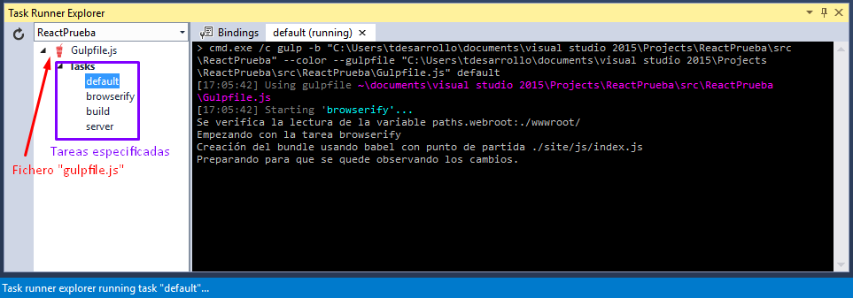

#Paquete gulp
Gulp nos ayuda a automatizar tareas en el despliegue y pre-compilación de la aplicación que de otra forma sería realizadas de forma manual. Dichas tareas se describen en un fichero llamado **"[gulpfile.js][linkGulpfile]"** el cuál situaremos dentro de la ruta raíz del proyecto y dentro de la carpeta donde se tenga puesto el código. 

>Recordemos instalar los módulos o paquetes necesarios antes de ejecutar el fichero **"gulpfile.js"** para que no nos de errores de dependencia de paquetes requeridos.

Dicha automatización de tareas es en resumen, un sistema de construcción de streaming mediante la cual nos permite concatenar y pasar los datos/ficheros los cuáles están siendo manipulados por los diferentes plugins. Por tanto, es normal que un mismo fichero pase entre distintos plugins.

##¿Por qué utilizar **"gulp"** y no **["grunt"][gulpVSgrunt]**?
Aunque se venga utilizando popularmente "grunt", "gulp" presenta una serie de ventajas:
- **Intercambio de información entre procesos más fácilmente.**
- Esquema de **"pipes"** más resumido.
- **Mejora la legibilidad**, permitiendo así seguir el flujo.
- Disposición de variables que cargan librerías.
- Realiza **menos pasos a la hora de manipular los archivos** al realizar sus tareas.

##Instalación
Instalaremos "gulp" de forma global para poder utilizarlo desde el prompt de Node.js (o línea de comandos) `> npm install -g gulp` 

Sobre la instalación podemos encontrar la [documentación necesaria][docGulp].

##Uso
1. Interacciona perfectamente con otros módulos. **"Gulp"** usará otros módulos de **"Node.js"** que se podrán identificar en el archivo "gulpfile.js" con el formato ` require = ('nombrePaqueteNpm')`.
> Si utilizamos **"package.json"** generado correctamente, al reinstalarlo nos instalaría los módulos necesarios (indicados en "devDependencies" y/o "dependencies" dentro del fichero). 
2. Podemos ejecutar tareas (manualmente) desde el prompt de Node.js: `> gulp <nombreTarea>`.
> Deberemos situarnos en la carpeta donde se encuentre nuestro fichero "gulpfile.js".

3. Las tareas de Gulp son compatibles con la ventana **"[Task Runner Explorer][enlaceTaskRunner]"** de Visual Studio. Como ejemplo disponemos de un proyecto en Visual Studio el cuál contiene el fichero **"gulpfile.js"** con cuatro tareas. En la esquina superior derecha podemos buscarlo y abrirlo, tal y como se muestra en la imagen:
>  

	Se nos abrirá la ventana correspondiente, seleccionaremos del desplegable el proyecto que contiene gulpfile.js (nos aparecerán tantos como hemos indicado), en nuestro caso tendremos varias ++tareas bindeadas++ (o enlazadas):
> 
*Observamos que tenemos cuatro tareas, no se ejecutarán hasta que lo indiquemos mediante selección del ratón directamente sobre la tarea o bien mediante el menú contextual, el cuál nos muestra dos opciones:*
>+ **"Run"**, ejecutar la tarea.
>+ **"Bindings"**, disponemos de cuatro acciones a enlazar:
>	* ___Before build,___se produce antes de "construir" o compilar.
>	* ___After build,___antes de compilar la solución.
>	* ___Clean,___cuando se limpie el proyecto.
>	* ___Open project,___al abrir el proyecto.

##Métodos más utilizados
En principio disponemos de:
+ **"gulp.task"**, utilizado para definir las tareas y cuyos argumentos son: nombre, dependencia y función. El "nombre" es una cadena de tipo String, la dependencia es de tipoo "array" de una seire de nombres de tareas y la "función" es la que configura la tarea. La "dependencia" es opcional, como en el siguiente ejemplo:

>```javascript
gulp.task('miTarea', function(){
	// líneas de código
});
>
gulp.task('otraTarea',['miTarea','miTarea2','...']);
```
> Podemos implementar una tarea únicamente o bien otra que sea la suma de otras. 

+ **"gulp.src"**, apunta a los ficheros que se desean utilizar. Emite los archivos que coinciden proporcionando un array de globales para luego devolver una secuencia ("stream") de ficheros "Vinyl" que se pueden encadenar hacia otros plugins.
> STREAM: los "streams" son objetos que nos permite leer datos desde el origen o escribir datos hacia un destino de manera contínua. 
+ **"gulp.dest"**, apunta a la carpeta de salida en la cuál queremos escribir archivos, pudiendo encadenar y escribir archivos. Reenvía todos los datos que se le pasan, pudiendo guardarlos en una o varias carpetas, en el caso de que no existan estás, las creará.  

>```javascript
gulp.src('./client/templates/*.jade')					//fichero de origen
	.pipe(jade())
	.pipe(gulp.dest('./build/templates'))				// carpeta de destino
	.pipe(minify())
	.pipe(gulp.dest('./build/minified_templates'));		//carpeta de destino
```

> Tanto **"gulp.src"** como **"gulp.dest"** son utilizados simplemente para copiar ficheros.

Toda la información sobre los métodos utilizados en **[gulp API docs][enlaceMetodosGulp]**.

##Paquete gulp-concat
Paquete que necesitaremos para concatenar o añadir los ficheros que indiquemos en el fichero "gulpfile.js" y que gulp pasará a browserify para que a su vez genere el fichero principal con todos aquellos ficheros javascript que deseemos.

###Instalación
Desde el prompt de Node.js `> npm install --save-dev gulp-concat`

##Paquete gulp-webserver
Es un módulo reescrito a partir de "gulp-connect", por lo que es otro plugin de "gulp" que nos permitirá ejecutar un servidor web de forma local con recarga automática o "LiveReload". Es decir, cualquier modificación realizada en los ficheros de nuestro proyecto "provocará" la recarga de la página de forma automática.

###Instalación
Desde el prompt de Node.js `> npm install --save-dev gulp-webserver`

##Referencias
+ [Ejemplo de fichero "gulpfile.js"](2_1_gulpfile.md).
+ [Uso de Gulp](http://frontendlabs.io/1669--gulp-js-en-espanol-tutorial-basico-primeros-pasos-y-ejemplos).
+ [Documentación en GitHub sobre "gulp-concat"](https://github.com/contra/gulp-concat).
+ ["npm" gulp-concat](https://www.npmjs.com/package/gulp-concat).
+ [Documentación en GitHub sobre "gulp-webserver"](https://github.com/schickling/gulp-webserver)
+ ["npm" gulp-webserver](https://www.npmjs.com/package/gulp-webserver).
+ [Guía para principiantes - Task Runner Gulp](http://andy-carter.com/blog/a-beginners-guide-to-the-task-runner-gulp).
+ [¿Qué son los streams? (en Node.js)](http://www.tutorialspoint.com/nodejs/nodejs_streams.htm)

<!-- Enlaces y referencias del documento -->
[linkGulpfile]:2_1_gulpfile.md
[docGulp]:https://github.com/gulpjs/gulp/blob/master/docs/getting-started.md
[gulpVSgrunt]:http://blog.koalite.com/2015/06/grunt-o-gulp-que-uso/
[enlaceTaskRunner]:http://webtooling.visualstudio.com/task-runners/
[enlaceMetodosGulp]:https://github.com/gulpjs/gulp/blob/master/docs/API.md

