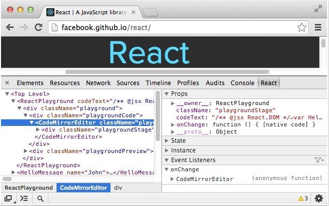
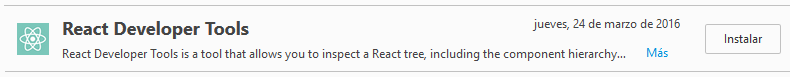
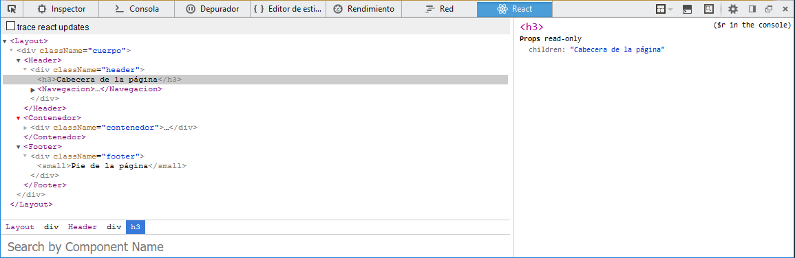
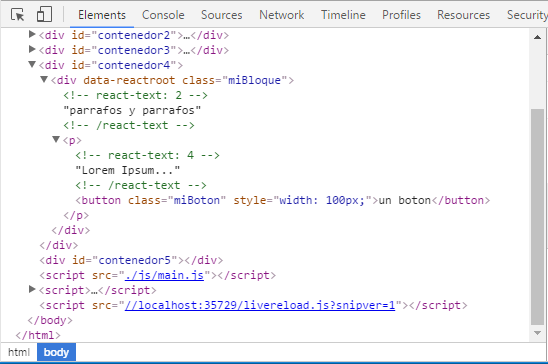
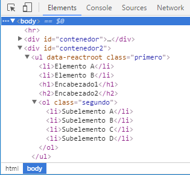
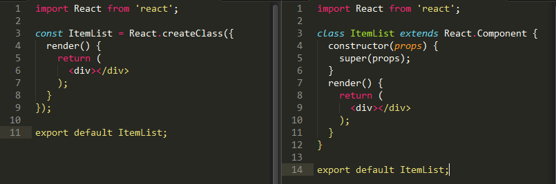

##Paquete React.js "npm"

Por otra parte tenemos el módulo correspondiente que podemos encontrar en el gestor de paquetes **"npm"**. Nos permitirá acceder al código introducido en "React.js" sin requerimiento de la transformación de JavaScript XML (JSX)

###Instalación

Desde el prompt de Node.js `> npm install --save react` para que se guarde como dependencia dentro del fichero "package.json" de nuestro proyecto.

> **JSX:** es lenguaje JavaScript para utilizar etiquetas en formato XML para crear elementos en el DOM, así dentro de la página HTML podremos utilizar diferentes componentes.

Una vez instalado el módulo, importaremos el módulo mediante `import React from 'react';` para utilizar los métodos correspondientes en nuestro nuevo componente "react".

###Instalando React Developer Tools (extensión/plugin)

####En Google Chrome

Para poder realizar el ***"debug"*** tendremos que tener instalando en el navegador Google Chrome como **"herramienta para desarrolladores"** como **[extension][enlace1]** y aquí tenemos la **[información sobre dicha extensión][enlace2]** en a la página oficial de React.js explicando el funcionamiento de la versión estable

>**Debugger:** es un programa que se utiliza para testear y "depurar" otros programas. El código es examinado 

alternativamente mientras está funcionando mediante un simulador de instrucciones *(fuente: Wikipedia)*.  



Esta extensión complementa las herramientas de desarrollo de Chrome para poder visualizar los archivos JavaScript XML.  

####En Mozilla Firefox

Para aquellos usuarios de Mozilla Firefox también está disponible como complemento:

  


Donde podremos navegar por los diferentes componentes y subniveles dentro del componente principal:

  


***

####[Componentes básicos React en el DOM Virtual][enlaceComponentesreact]

Dentro de la terminologia del React DOM disponemos de cinco componentes:

+ ReactElement.
+ ReactElement Factory.
+ ReactNode.
+ ReactComponent.
+ ReactComponent Class.  

#####React Elements
Representa a cada uno de los elementos que renderizará React en el DOM. Por hacer una equivalencia valida (que no implica que sea lo mismo) podríamos pensar que son etiquetas HTML con todos sus atributos. És ligero, sin estado, no cambia y es una representación virtual de un elemento DOM.

React Element cómo objeto plano JavaScript tiene cuatro propiedades: `type`,`props`,`key` y `ref`. No disponde de `prototype` ni métodos. Detallamos a continuación dichas propiedades **([más información aquí](https://medium.com/@fay_jai/react-elements-vs-react-components-vs-component-backing-instances-14d42729f62#.9endxm4ji)):**
+ `type` puede tener dos valores, una cadena que representa cualquier elemento HTML válido o bien una referencia a una clase React Component.
+ `props` es un mapeado de todos los `props` y los valores pasados a los componentes secundarios.
+ `key` utilizada para identificar de forma específica los React Elements que encontramos dentro de un mismo array que contiene más React Elements. En principio nos estamos obligados a proporcionar ningún valor pero en caso contrario, React podrá realizar el proceso de renderizado más eficientemente.
+ `ref` utilizada para acceder al elemento DOM subyacente asociada con una versión renderizada de este React Element.

La sintaxis de React Element (en JavaScript):

```javascript
//orden de sintaxis de las propiedades de un React Element ( u objeto).
let myVar = React.createElement([type],[props],[key],[ref]);

//ejemplo de sintaxis
let variable = React.createElement('etiqueta',null,'texto',elemento);
```
Explicamos el ejemplo anterior:
+ **"etiqueta"** de HTML.  
+ el valor **null**, sirva para indicar que ___no tiene clase (o sí)___.  
+ **"texto"** que aparecerá dentro del elemento.  
+ **elemento** de React donde se indica que es hijo del padre principal. En caso de que fuera éste último, indicaríamos el nodo DOM dónde se renderizarán todos los elementos que hemos creado y anidado anteriormente.

Como constructor de un React Elements usamos `React.createElement`:

```javascript
import React from 'react';
import ReactDOM from 'react-dom';

//Ejemplo de Constructor
let root = React.createElement('p');
//Ejemplo de Renderizado del React Element dentro del <div> con el atributo id igual a contenedor.
ReactDOM.render(parrafo,document.getElementById('contenedor'));
```

Éste crea y devuelve un nuevo elemento `ReactElement` por ejemplo: `<button>`, `<div>`,`<span>`**[...más etiquetas soportadas...][enlaceAtributosetiquetas]** Pero no podemos renderizar más de 1 elemento en un contenedor `<div>` con el mismo identificador (id) puesto que mostraría el último que declaráramos (este contenedor, generalmente un `<div>` lo encontramos localizado dentro de nuestro **"index.html"**). Pero si tenemos distintos identificadores para cada bloque, podremos renderizar todos los elementos que indiquemos. Es decir, los elementos creados los pasaremos mediante "ReactDOM.render" junto con un elemento DOM (pudiendo ser HTML o SVG) siendo parte del DOM virtual.  

> Usando `ReactDOM.render() ` instanciamos para crear un React Component (como hacíamos en Java con new para instanciar un objeto de una clase) con lo que renderizamos (o dibujamos) un React Element en un elemento DOM en particular siendo el valor devuelto por `ReactDOM.render()` una instancia del React Component.
> El componente instanciado devuelto por `ReactDOM.render()` puede llamar a los métodos definidos en la clase React Component. **([enlace para más información](https://medium.com/@fay_jai/react-elements-vs-react-components-vs-component-backing-instances-14d42729f62#.9endxm4ji)):**

```javascript
...//importar paquetes necesarios

let boton = React.createElement('button',{style:{width:'100px'},className:'miBoton'},'un boton');
let parrafo = React.createElement('p',null,'Lorem Ipsum...',boton);
let bloque = React.createElement('div',{className:'miBloque'},'parrafos y parrafos',parrafo);

ReactDOM.render(bloque, document.getElementById('contenedor'));
```

Con el código anterior conseguimos que un elemento esté dentro de otro pudiendo ver el resultado (utilizando el plugin de React en Google Chrome):




También podemos definir que en una única variable contenga distintas etiquetas HTML para después renderizarlas en nuestro SPA:

```javascript
var listado = <ul className="my-list">
             	<li>Text ContentA</li>
             	<li>Text ContentB</li>
             	<li>Text ContentC</li>
              </ul>;

ReactDOM.render(listado, document.getElementById('contenedor'));
```

#####React Element Factory

Será un elemento con una simple función que generará un `ReactElement` (elemento React) con una propiedad 'type'. Con lo que podemos crear un método rápido en vez de escribir `React.createElement` cada vez:

```javascript
let bloque = React.createFactory('div');
let componente = bloque({ className: 'my-div' });

ReactDOM.render(componente, document.getElementById('contenedor'));
```

Pero en principio `React` dispone de **[etiquetas HTML comunes][enlaceAtributosetiquetas]** como se muestra en el ejemplo siguiente. Disponemos de una variable que contiene un React Element con objetos y propiedades,a su vez mediante `React.DOM` otros React Element que serán etiquetas HTML válidas también con objetos y propiedades. Utilizamos `React.DOM` porque no estamos utilizando JSX para crear dichas etiquetas.  

```javascript
let bloque = React.DOM.ul({ className: 'primero' },
            React.DOM.li(null, 'Elemento A'),
            React.DOM.li(null, 'Elemento B'),
            React.DOM.h1(null,'Encabezado1'),
            React.DOM.h2(null,'Encabezado2'),
            React.DOM.ol({ className: 'segundo' },
                React.DOM.li(null,'Subelemento A'),
                React.DOM.li(null,'Subelemento B'),
                React.DOM.li(null,'Subelemento C'),
                React.DOM.li(null,'Subelemento D')
            )
);

ReactDOM.render(bloque, document.getElementById('contenedor2'));
```

Podremos ver los elementos desde el menú del desarrollador:



En el caso de que estemos utilizando JSX no tenemos la necesidad de utilizar `Factorias` ya que JSX también nos proporciona métodos para crear dichos elementos/etiquetas HTML comentadas anteriormente.

[**Más información sobre atributos y etiquetas soportados**][enlaceAtributosetiquetas] que podemos utilizar.

#####React Nodes
Un `ReactNode` puede ser:

+ Un elemento react
+ Un string
+ Un número
+ Un array de nodos react.  

Los cuales se utilizan como propiedades de otros "**elementos react**" para representar a los hijos, por lo que crean un árbol de elementos react.

#####React.component

Es un componente existente utilizado que podemos "extender" mediante ECMAScrip6, siendo la clase base para los componentes de "React". Podemos utilizar "React" utilizando sólo `ReactElements` pero para que sea más ventajoso es mejor utilizar `ReactComponent` para crear encapsulaciones con estados embebidos. Una "clase" `ReactComponent` es simplemente una clase JavaScript (o constructor).

Es decir, podemos incluir React Elements (o "children") dentro de un React Component ya que lo utilizamos como contenedor o "parent".  

La función `render()` en un componente react devuelve un árbol DOM de elementos react los cuales "mapean" todos los elementos del DOM de forma virtual.

```javascript
let Counter = React.createClass({ 
             getInitialState: function () { 
               return { count: 0 }; 
             }, 
         handleClick: function () { 
               this.setState({ 
                     count: this.state.count + 1, 
                   }); 
         }, 
         render: function () { 
               return ( 
                 <button onClick={this.handleClick}> 
                   Click me! Number of clicks: {this.state.count} 
             </button> 
           ); 
         } 
}); 

ReactDOM.render( 
         <Counter />, 
         document.getElementById('contenedor2') 
       );
```

Debemos evitar instanciar un objeto de la clase que hemos creado anteriormente. No tenemos que llamar al constructor porque "React" se encargará de hacerlo, además podemos cambiar la clase del `ReactComponent` a un `createElement` para obtener así un `ReactElement`:

```javascript
var elemento = React.createElement(Counter);
// o bien podemos usar JSX
var elemento = <Counter />;

var componente1 = ReactDOM.render(elemento,document.getElementById('contenedor'));
```

Cuando este sea renderizado mediante el método `ReactDOM.render` se llamará al constructor para que cree y devuelva un componente.

####[Diferencias entre React.createClass y React.Component][enlaceDiferenciasreact]
React nos proporciona la sintaxis para permitir un uso mejor con los módulos **[ES6 (o ECMAScript 2015)][enlaceECMA2105]** mediante `extends React.Component` el cual extiende la clase `Componet` en vez de llamar a `createClass`.

#####Sintáxis
| React.createClass | React.Component |
|:--------:|:--------:|
| Asignación de una constante `const` a la clase React| **[Uso de clases en ES6][enlaceECMA2105]**|
| Función `render` contenedor `<div>`| Creación constructor `super()` para paso de `props`|

> Al declarar la clase `class` la extendemos mediante el uso de `React.Component` en vez de acceder directamente usando `React.createClass`

#####propTypes y getDefaultProps
| React.createClass | React.Component |
|:--------|:--------|
|`propTypes` objeto dónde podemos declarar el tipo de dato para cada `props`| Creación `constructor` con `super(props)`|
|`getDefaultProps` función que devuelve un objeto indicando `props` iniciales|Métodos fuera del `class ItemList`:|
||`ItemList.propTypes = { ... };`|
||`ItemList.defaultProps = { ... };`|

#####State (diferencias de estado)
| React.createClass | React.Component |
|:--------:|:--------:|
|`getInitialState` objeto para estado inicial|`this.state = {...};` dentro del constructor|

#####Evento `this`  
| React.createClass | React.Component |
|:--------:|:--------:|
|Toma los valores automáticamente|**[Usando clases en ES6][enlaceECMA2105]** no se instancian automáticamente|

#####Mixins
Sólo los podremos utilizar en los `React.createClass` ya que las clases en **[ES6][enlaceECMA2105]** no están soportadas, por lo que no hay **mixins** para `React.Component`.


####[Etiquetas HTML - React Components][EnlaceEtiquetashtml]
Además de renderizar componentes React (clases) también lo hace con **[etiquetas HTML][enlaceAtributosetiquetas].** En este ejemplo tenemos:

```javascript
... // importar módulos
let unParrafo = <p className="p1" style={{color:'red',fontSize:30}}>Esto es un párrafo</p>;

ReactDOM.render(unParrafo,document.getElementById("contenedor"));
```

+ `className` para indicar la propiedad CSS pero en JSX.

+ Podemos indicar que el elemento tenga un estilo CSS previamente definido, para ello podemos indicarlo mediante `style={{...}}` que es la sintaxis correcta para ficheros JSX o bien mediante una variable en donde indicamos las propiedades CSS `var paragraph= {color:'red', fontSize: 20};` y después se añade como parámetro dentro de la declaración de la variable `...style={paragraph}...`  

+ **[Más información sobre estilos ("style") en JSX](https://github.com/petehunt/jsxstyle).**

+ **[Inline Styles - Web oficial de React](https://facebook.github.io/react/tips/inline-styles.html).**

##[ReactDOM.render](https://facebook.github.io/react/docs/top-level-api.html)
Lo obtendremos del paquete `react-dom` importándolo (siguiendo la sintaxis **[ECMAScript6/ECMAScript 2015)](http://www.ecma-international.org/ecma-262/6.0/#sec-terms-and-definitions-object):**

```javascript
import ReactDOM from 'react-dom';
```

Renderizar un React Element en el DOM en el contenedor indicado(mediante un "id") nos devolverá una referencia al componente (o bien puede devolver un valor nulo para aquellos componentes sin estado).  

En el caso de que el React Element fuese renderizado previamente dentro del contenedor se llevará a cabo una actualización sobre él mismo modificando el DOM para mostrar el último React Component, es decir, si tenemos un React Element de primer nivel y dentro de él contuviese hijos, se modificarían estos últimos en el rederizado de la aplicación en nuestro navegador.

La sintaxis de `ReactDOM.render` es la siguiente:
```javascript
render(
	ReactElement element,
    DOMElement container,
    [function callback]
)
```
Y el ejemplo aplicado podría ser:
```javascript
let span = React.createElement('span', null, 'Esto es un span'); //hijo
let parrafo = React.createElement('p', { className: 'my-parrafo' }, span); //padre
ReactDOM.render(parrafo, document.getElementById('container')); // <div id='container'>

// o bien mediante JSX, donde el React Element sería un conjunto de etiquetas que 
//después se encargaría ReactDOM de renderizar transformándolo como un React Element
let etiqueta = <hgroup className="my-headers">
             <h1>Cabecera 1</h1>
             <h2>Cabecera 2</h2>
           </hgroup>;
ReactDOM.render(etiqueta, document.getElementById('container'));
```

El React Element que indicaremos dentro del `ReactDOM.render()` puede ser código JSX, referencia a una clase de un React Element (`React.createClass`) o bien a una extensión de la clase de un React Component `React.Component`.

```javascript
//crear clase de un React Element
let Counter = React.createClass({ 
         render: function () { 
             return ( 
                 ...
           ); 
         } 
});
//extensión de React Component
class Foo extends React.Component{ 
    render() {
        return (
			...
        )
    }
}
```

Por otra parte `ReactDOM.render()`:
+ Controla el contenido del nodo contenedor que le hemos pasado. Al cargar por primera vez, los elementos existentes dentro del DOM se reemplazan. Para posteriores "cargas" se utiliza el **[algoritmo diffing DOM de React](http://www.oyecode.com/2015/09/reactjs-learning-virtual-dom-and-react.html)** para realizar las actualizaciones, es decir, utiliza dicho algoritmo para identificar diferencias producidas en el árbol DOM.  

+ No modifica el nodo contenedor, sólo los hijos contenidos dentro de él. Se contempla la posibilidad de insertar un componente en un nodo DOM existente sin sobreescribir el hijo.  

>**[Más información sobre los métodos de ReactDOM](https://facebook.github.io/react/docs/top-level-api.html#reactdom.unmountcomponentatnode).**

>**[React.js - Virtual DOM and React Diff Algorithm](http://www.oyecode.com/2015/09/reactjs-learning-virtual-dom-and-react.html).**

>**[React.js Render Web](http://blog.nparashuram.com/2015/12/react-web-worker-renderer.html).**

##Referencias
+ [Página oficial de "npm".](https://www.npmjs.com/)
+ [Página oficial de react.js.](https://facebook.github.io/react/index.html)
+ [React.js - blog oficial - versiones.](https://facebook.github.io/react/blog/)
+ [Lista completa de cambios en la versión 15.0.](https://facebook.github.io/react/blog/2016/04/07/react-v15.html)
+ [¿What is debbuging?](https://en.wikipedia.org/wiki/Debugging)
+ [Página oficial de react.js en npm.](https://www.npmjs.com/package/react)
+ [Vídeo: Curso React.js por OutKast.](https://www.youtube.com/watch?v=utAoFpE0tJs&index=1&list=PLEtcGQaT56ci0QiNycpR8mXWeaXcZn5yA)
+ [Vídeo: React.js en #programadorIO.](https://www.youtube.com/watch?v=ejMEwNVoOT0)
+ [Vídeo: Curso de React.js framework de facebook (latino)](https://www.youtube.com/watch?v=EDhvRw93Ui8&list=PLSuKjujFoGJ2XwyfRvH2nvJ44gvxBEPOd).
+ [Ejemplo de aplicación con React.js y ECMAScript 6](https://carlosazaustre.es/blog/ejemplo-de-aplicacion-con-react-js-en-ecmascript-6/)
+ [Ejemplo uso de React.js 0.14 con ECMAScript 6-7](http://blog.ricardofilipe.com/post/babel-react-es7-sample)
+ [Completa introducción a React.js (marzo 2016)](https://btholt.github.io/complete-intro-to-react/)
+ [Tutorial de React.js en Tutorials-Point](http://www.tutorialspoint.com/reactjs/index.htm)
+ [Diferencias entre React.createClass y React.Component](https://toddmotto.com/react-create-class-versus-component/)

<!-- Referencias  ocultas -->
[enlace1]:https://chrome.google.com/webstore/detail/react-developer-tools/fmkadmapgofadopljbjfkapdkoienihi
[enlace2]:http://facebook.github.io/react/blog/2015/09/02/new-react-developer-tools.html
[enlaceComponentesreact]:https://facebook.github.io/react/docs/glossary.html
[enlaceReact1501]:https://platzi.com/blog/react-15/
[enlaceEtiquetasHTML]:https://facebook.github.io/react/docs/jsx-in-depth.html
[enlaceAtributosetiquetas]:https://facebook.github.io/react/docs/tags-and-attributes.html
[enlaceDiferenciasreact]:https://toddmotto.com/react-create-class-versus-component/
[enlaceReact150]:https://facebook.github.io/react/blog/2016/04/07/react-v15.html
[enlaceReact148]:https://facebook.github.io/react/blog/2016/03/29/react-v0.14.8.html
[enlaceReact14]:https://facebook.github.io/react/blog/2015/10/07/react-v0.14.html
[enlaceECMA2105]:https://babeljs.io/blog/2015/06/07/react-on-es6-plus
