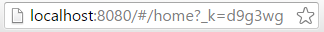
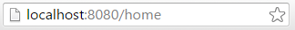

##Paquete react-router.js

Nos permite crear tablas de rutas en el cliente completamente integradas en "React.js". Esto nos permite tener un comportamiento de nuestra web como una SPA.

> **SPA**: *"Single-page application"* o aplicación de página única es una aplicación/sitio web que cabe en una sola página con el propósito de dar una experiencia más fluida a los usuarios como una aplicación de escritorio *(fuente: Wikipedia)*.

Para conocer los distintos cambios producidos en cada versión de "react-router" **[podemos verlos en este enlace][enlaceCambiosReact]**.

###Instalación propuesta
La documentación sobre la instalación la podemos encontrar [aquí][enlaceReactrouter].

Desdel prompt de Node.js `npm install --save react-router`

###Uso
Cada ruta que se mapee, será un componente de "React", por lo que cada dirección renderizará el compononente que mapea.

Como requisito para el navegador se necesita que soporte **["Session history management"][enlaceSessionmanagement]** o (HistoryApi) mientras que en los servidores, los cuales no lo soportan todos, podemos configurar el uso de **["HashChange"][enlaceHashchange]**.

Dicha tabla se define en un archivo JSX (por ejemplo: js/routes.jsx). Aunque podemos utilizar un JS utilizando el estándard ECMAScript 6 (como el código siguiente). Podemos poner en marcha automáticamente las rutas para poder navegar por nuesta SPA:
```javascript
// importamos los módulos necesarios
import React from 'react';
import { ReactDOM, Render } from 'react-dom';
import { Router, Route, browserHistory, IndexRoute, Redirect } from 'react-router'; 

// importamos los ficheros JSX
import App from './components/app.jsx';
...
import NotFound from './NotFound.jsx';

let routes = (    
    <Router history={browserHistory} >
        <Route path="/" component={App} >
            <IndexRoute component={Indice} />
            <Route path="home" component={Home} >
          	   <IndexRoute component={IndexHome}/>
         		<Route path="home/home2" component={Home2} />
            </Route>
            <Route path="about" component={About} />
			<Route path="messages/:id" component={Message} />
            <Route path=":org" component={Depart} />
            <Redirect from="about-us" to="about" />
            <Redirect from="abouts" to="about" />
            <Route path="*" component={NotFound} />
        </Route>
    </Router> 
) 

export default routes;
```

Elementos que podemos utilizar:
+ **Router**: compomente primario de **"react-router"**. Se encarga de mantener la interfaz de usuario y la dirección URL en sincronía.

+ **Route:** define la tabla de enrutamiento de forma jerárquica. Equivale al "Layout" (entorno común de la SPA). Este caso se ha optado por nombrar la app.
	+ **history:** es una propiedad utilizada para guardar la ruta de las distintas páginas del SPA, es decir, modificamos el historial del navegador pero sin recargar la página. Se puede indicar como objetos: "hashHistory" o bien "browserHistory". "React-router" está construido con un historial para escuchar en la barra de direcciones del navegador los cambios y analizar la URL pasándolo a un objeto que `<Router>` pueda utilizar para buscar la ruta y renderizar los componentes asociados a la ruta.
	>**React-router** antes utilizaba por defecto la creación del historial mediante "hash", pero ahora debemos indicarlo. Grácias a esto se ayuda a mantener el tamaño del paquete de la aplicación. Se recomienda utilizar **browserHistory** ya que usa la historial de la API de HTML5 (cuando esté disponible).
    
	| hashHistory | browserHistory |
    |:-----:|:-----:|
    |URL's basadas en hash.|URL's de las páginas con formato HTML5 pushState |
|||
	>Antes mediante el hash de la URL las aplicaciones AJAX y Flash podían soportar la interacción del historial. Con la llegada de HTML5 se incluyó el método ***pushState()*** para cambiar directamente la URL actual del navegador sin refrescar la página [**enlace a más información**][html5Pushstate].

	>**"browserHistory" soporta IE8 e IE9**, ya que detecta si es posible utilizar la API nativa del navegador de "window.history", en caso contrario cualquier llamada provocará la recarga completa de la página ... [**más información**](https://github.com/reactjs/react-router/blob/832c42946c874fe56ffde0066b1088054311cb98/docs/guides/basics/Histories.md).
    
	+ **handler: (obsoleto)** componente "React.js" a renderizar. El comportamiento del componente "React" queda superpuesto sobre el "Layout" o contenedor principal. Podemos utilizarlo pero en ese caso nuestra SPA dejaría de comportarse como tal.
	
	+ **component:** componente "React.js" a renderizar. Al utilizarlo podremos renderizar los distintos "children" o componentes de segundo nivel dentro del "Layout" o contenedor principal. ***Un componente es un componete React (una clase o una cadena), siendo básicamente "algo" que puede ser utilizado como primer argumento para el méotodo `React.createElement`***.
	
	+ **path:** ruta del navegador que pone el usuario (poner path="/" es lo mismo que no poner el atributo). El caso de utilizar `path="*"` y escribimos cualquier cosa nos erenderizará el componente `NotFound` la cuál contendría un mensaje de error personalizado (parecido al error 404 cunado el navegador web no encuentra la ruta). También deberemos situar este al final de todas las rutas porque de lo contrario, al ponerlo al principio o en medio de nuestras rutas, serán consideradas **"404"** ya que las "path" coinciden con cualquier cosa por el "\*". [**Si queremos saber más sobre la sintaxis "path"**][enlaceSintaxispath].
	
	> NOTA: no confundir el parámetro de *url* con **[QueryString][enlaceQuerystring]**. El parámetro de url equivale al route.value de ASP.MVC pero en el cliente.

	Por lo tanto, el componente **Message** o su padre (en este caso App.jsx) deberá de tener una propiedad que la recibirá cuando se instancie. Esta propiedad se llamará **params** la cuál, para este ejemplo, tendrá otra denominada **id**, que será la que recibirá el valor.
	+ [**name: (obsoleto)**][enlaceRoutename] nombre de la ruta. Es como se redireccionará entre las distintas "páginas" que ahora son componentes "React.js". En caso de no ponerlo, el comportamiento será el mismo. A partir de la versión 1 ya no es necesario indicarlo puesto que es suficiente con el "path".
	
+ [**DefaultRoute: (obsoleto)**][enlaceObsoleto2] si no se pone un subelemento indicamos el componente a renderizar. Esto se suele usar en los nodos raíces. Para obtener el mismo resultadodeberemos usar **"IndexRoute"**.
+ [**NotFoundRoute: (obsoleto)**][enlaceObsoleto] si no existe la dirección puesta sabe que componente renderizar. A partir de la versión 1.0 ha sido eliminado porque confundía a los desarrolladores ahora simplemente con utilizar `<Route path="*" component={...}/>`.

+ **Redirect:** define los enrutados sinónimos. Ejemplo: si escribimos en el navegador "about-us" nos redirige a "about".

+ **IndexRoute:** establecido previamente el tipo de historial, la ruta inicial será el componente "Layout" que es el padre, pero para que renderice éste tendremos que indicarlo mediante `IndexRoute` y  para que a su vez nos muestre los hijos que contiene necesitamos usar la propiedad `{this.props.children}` que estará dentro del nodo padre.

Dentro de la ruta principal `"/"` hemos indicado que pertenece al componente "Layout" el cual es el padre y a su vez, las rutas contenidas dentro hacen referencia a otros componentes que serán hijos del contenedor principal que hemos establecido y que se mostrarán. En el caso de que saquemos dichos componentes fuera de la ruta inicial, sólo se mostrarán estos puesto que no tienen ningún padre antecesor.

> Podemos realizar anidamientos de `<IndexRoute>` sucesivos en componentes hijos que a su vez también sean padres con más nodos a su vez:  
```javascript
<Router history={browserHistory} >
        <Route path="/" component={Layout}>
            <IndexRoute component={Indice}/>
            <Route path="home" component={Home} />
            <Route path="casa" component={Casa} >
            	<IndexRoute component={IndiceCasa} />
                <Route path="casa/roja" component={Roja} />
                <Route path="casa/azul" component={Azul} />
			</Route>
            <Route path="about" component={About} >       
        </Route>
</Router>
```

En el ejemplo se puede ver cómo los 2 primeros objetos "React" se han referenciado a variables mientras que los siguientes se han instanciado directamente.

> Para un correcto funcionamiento hay que configurar el servidor para que todo el contenido vaya a index.html, pues este es el que realizará el mapeado y el servidor lo desconoce.

Resumiendo, disponemos de un html con un sólo archivo JavaScript (compuesto por otros). En la tabla de rutas hemos puesto con qué componente se renderizará, además le hemos puesto un "Layout" (en este caso app.jsx). 

####Nuestro mapa del sitio quedará:  

| URL | Componentes | Propiedades| Detalles |
|:--------:|:--------:|:------:|:---------:|
| / | App -> Index | Nodo padre|Contenedor principal|
| /home|App -> Home|{this.props.children}| Renderizado del hijo dentro del padre|
| /about| App -> About|{this.props.children}|Renderizado del hijo dentro del padre|
|/home/home2| App -> Home -> Home2|{this.props.children}|Renderizado del hijo dentro del padre|


####Otros componentes obsoletos a partir de la versión 1.0
+ [**RouteHandler**][enlaceObsoleto] ahora automáticamente rellena utilizando `this.props.children` de los componentes en base a la ruta activa. Como todos los componentes de "React" que reciben "children" de su "parent" también es posible utilizar la plantilla `React.cloneElement` para añadir "propiedades" (props) al descendiente.
+  `<Route name="about" />` todavía podemos anidar las rutas ya que éstas se heredan del "parent". Ha sido quitado a partir de la versión 1.0 por los siguientes motivos:
	+ La carga dinámica de la configuración de rutas, esto implica que no se puede construir URLs reales para las etiquetas `<Link>` cuya configuración de rutas todavía no se ha cargado.
	+ El uso de las rutas URL reales con `<Link to>` no toma tiempo extra para la búsqueda de la ruta / nombre.
	+ No es necesario saber el parámetro "name" para crear links.
	+ Se refuerza a los usuarios a no cambiar sus URLs en vez de usar `<Redirect>`.
  **Más información sobre ["Route name"][enlaceRoutename].**

###Renderizado
Ahora falta indicarle dónde se rendizarán los componentes de las vistas.

```javascript
import React from 'react';
import render from 'react-dom';
import Router from 'react-router';

import Rutas from './routes.jsx';
render(Rutas,document.getElementById('contenedor'));
```

+ Mediante el acceso al DOM (dentro de nuestro fichero **"index.html"**):
	+ `document.getElementById('contenedor')` : utilizaremos una etiqueta contenedora con su identificador.
	+ `document.body` : para renderizar directamente en el cuerpo de la página web.

+ Anteriormente utilizábamos el método `Router.run` pero ha quedado obsoleto por lo que utilizaremos "render" a partir del paquete "react-dom".

> NOTA: todo JSX sólo puede tener un elemento de primer nivel, por lo que lo pondremos todo dentro de etiquetas `<div></div>`.

Para que el enrutamiento funcione es necesario iniciarlo previamente, por lo que tendremos que poner en el fichero "index.js" su inicializador.
```javascript
import './routes.jsx';
```

A la hora de mostrar los componentes secundarios dentro del componente de nivel superior "App" podemos mostrar el índice de nuestra página indicando `{this.props.children || <Indice />}` en el caso de que en el fichero de rutas "routes.jsx" no tuviéramos `<IndexRoute>` . Indicamos que en la "App" mostrará los hijos o bien un componente "React".

####Links/Enlaces
Es posible utilizar la etiqueta `<a href>` para movernos entre las distintas vistas, pero esto ocasionaría que cargara de nuevo toda la página accediendo al servidor y perdiendo todo sentido como SPA, para evitar esto utilizaremos el elemento `LINK` que proporciona el paquete "react-router".

Aquí tendríamos nuestra "App" como contenedor principal de nuestra SPA, es un componente que contendrá los "Links":
```javascript
import React from 'react';
import Render from 'react-dom';
import {Link} from 'react-router';

import Footer from './Footer.jsx';
import Header from './Header.jsx';

console.log("llega a Layout.jsx")

//color del enlace al pulsar sobre él
const ACTIVE = { color: 'olive' }

class App extends React.Component{
    render(){
        return (<div>
                    <Header />
                    <h1>My App-Layout Home Pag</h1>
                    <ul>
                        <li><Link to="/home" activeStyle={ACTIVE}>/home</Link></li>
                        <li><Link to="/casa/mansion" activeStyle={ACTIVE}>/casa/mansion</Link></li>
                        <li><Link to="/about" activeStyle={ACTIVE}>/acerca de...</Link></li>
                    </ul>
                    {this.props.children}
                    <Footer />
                </div>)
    }
}

// tendremos que exportarla para que sea pública
export default App;
```
Observando el código anterior tenemos los siguientes enlaces:

#####Link

`const ACTIVE = { color: 'olive' }`
`<Link to="/home" activeStyle={ACTIVE}>/home</Link>`

+ El atributo **"to"** es utilizado como descriptor de ubicación, pudiendo pasarle como parámetros un cadena de caracteres (string) o un objeto:
	+   En el caso de pasarle la ruta, sólo soportaría rutas absolutas del tipo `/home/things` hace referencia al "path" de la ruta indicada en el fichero "routes.jsx". Al clicar tendrá el color indicado.
	
	+   Si es un objeto, pude contener cuatro claves:  
	
    | CLAVE | DESCRIPCIÓN |
    |:--------:|:--------:|
    |pathname|Una cadena de tipo String que representa la ruta para ir al link/enlace.|
    |query|Un objeto de una llave: el valor de los pares será fuertemente tipado|
    |hash|Un hash para poner en la URL. *Ejemplo: #/index?_k=a2s4gt*|
    |state|Estado persistente hacia la localización|
    |***Ejemplo:***|`<Link to={{ pathname: '/foo', query: { the: 'query' } }}/>`|  
	
+ **"activeStyle"** es el estilo que se le aplicará al elemento enlazado cuando está activa su ruta, es decir, cuando cliquemos sobre el enlace tendrá el color que queramos, al perder el foco tendrá el color por defecto.  

	`<Link to="/home/authors" activeClassName="activo"></Link>`

+ **"activeClassName"**, se recive el atributo `className` en una etiqueta `<Link>` cuando la ruta está activa. No se activa la clase por defecto.
+ Enlaces con parámetros
	+ `<Link to="manageAuthor" params={{ id: "X"}}>Ir al Autor<Link>` 
	> La palabra **params** se refiere a un objeto de tipo clave/valor que es parseada fuera de la ruta de acceso URL original. Como valor de dicho objeto son generalmente "strings". En el caso de que hubiera más de uno, el valor sería una matriz.
	+ Para versiones posteriores `<Link to="manageAuthor" id="X">Ir al Autor<Link>` 
	+ Ejemplo complejo siguiendo [**la tabla de enrutamiento**][enlaceParamsareactive]:
		+ `<Route path="/assignament" path="/courses/:courseId/assignment/:id"/>`
		+ `<Link to="/assignement" courseId={assignment.courseId} id={assignment.id} />`
		+ `<Link to="/assignment" params={assignment} />` 
		+ [Más información](http://stackoverflow.com/questions/30115324/pass-props-in-link-react-router).

+ Otros atributos que podemos utilizar (como si se tratara de la `<a hfref>`): title, id, className... 

#####IndexLink

Es parecido a `<Link>` excepto si sólo está activo cuando la ruta actual es exactamente la ruta enlazada. También equivale a poner `<Link>` con la propiedad `onlyActvideOnIndex`

Más información sobre `<Link>` `<IndexLink>` ... [**en la API de react-router**][enlaceLinkreactrouter].  

###Eventos
Podemos utilizar los eventos `onEnter={}`, `onLeave={}` dentro de las etiquetas `<Route>` y `<Link>` en el caso de que queramos se ejecuten funciones (objetos, etc.) al cargar la tabla de enrutamiento o bien el componente "React" que tenga en sus enlaces dicho evento. Hemos observado que los dos eventos se comportan igual.  

[**Más información sobre Router**][enlaceRouter]  

##Referencias
+ [Guía actualizada "react-router" (12/04/2016)](https://github.com/reactjs/react-router/blob/master/upgrade-guides/v2.0.0.md).
+ [Historial del navegador usando **react-router**](https://github.com/reactjs/react-router/blob/master/docs/API.md#histories).
+ [**¡Importante!** - Modificaciones realizadas para "react-router"](https://github.com/reactjs/react-router/blob/832c42946c874fe56ffde0066b1088054311cb98/CHANGES.md).
+ ["npm" react-router](https://www.npmjs.com/package/react-router).
+ [Navegadores que soportan HashChange](http://caniuse.com/#search=Hashchange).
+ [Navegadores que soportan History Management](http://caniuse.com/#feat=history).
+ [¿Qué es query string?](https://es.wikipedia.org/wiki/Query_string).
+ [Ejemplo de enrutamiento con react-router](https://css-tricks.com/learning-react-router/).
+ [Introducción a react-router](https://www.themarketingtechnologist.co/react-router-an-introduction/).
+ [React router basics (marzo 2016)](https://themeteorchef.com/snippets/react-router-basics/#tmc-installation).
+ [Glosario de términos react-router](https://github.com/reactjs/react-router/blob/master/docs/Glossary.md#enterhook).
+ [Fichero "gulpfile.js"](2_1_gulpfile.md).

<!-- Referencias ocultas -->
[enlaceReactrouter]:https://www.npmjs.com/package/react-router
[enlaceSessionmanagement]:http://caniuse.com/#feat=history
[enlaceHashchange]:http://caniuse.com/#feat=hashchange
[enlaceQuerystring]:https://es.wikipedia.org/wiki/Query_string
[html5Pushstate]:http://www.cristalab.com/tutoriales/cambiar-la-url-sin-recargar-con-html5-pushstate-c94749l/
[enlaceCambiosreact]:https://github.com/reactjs/react-router/blob/master/CHANGES.md
[enlaceLinkreactrouter]:https://github.com/reactjs/react-router/blob/master/docs/API.md#link
[enlaceParamsareactive]:https://github.com/reactjs/react-router/issues/217
[enlaceRouter]:https://github.com/reactjs/react-router/blob/master/docs/API.md#router
[enlaceRoutename]:https://github.com/reactjs/react-router/issues/1840
[enlaceObsoleto]:https://github.com/reactjs/react-router/blob/master/upgrade-guides/v1.0.0.md
[enlaceObsoleto2]:https://css-tricks.com/learning-react-router/
[enlaceSintaxispath]:https://github.com/reactjs/react-router/blob/832c42946c874fe56ffde0066b1088054311cb98/docs/guides/basics/RouteMatching.md
