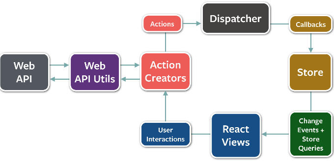
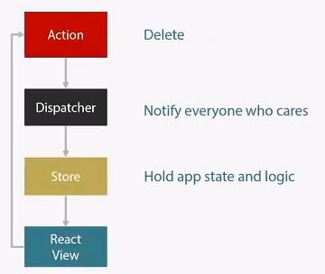

#Paquete Flux para node.js

##[Cambios en Flux][enlaceVersionesflux]
Para ver la versión de que disponemos en nuestro sistema tendremos que ejecutar desde el prompt de node.js el siguiente comando:  
`>npm show flux version`

| Versión | Detalles |
|--------|--------|
|2.1.0|Añadido **flux-utils** que contiene las bases principales : `Store`, `ReduceStroe`, `MapStore`, `Container`|        
|2.1.1|Publicada la carpeta `dist/` en "npm".|
|3.0.0|`FluxMapStore`: borrado.|
||`FluxContainer`: las suscripciones están configuradas en el constructor y no en el `componentDidMount`.|
||Además podemos crear **"containers"** usando componentes funcionales sin estado. Usa la versión funcional de `setState`.|
||`FluxMixin`: las subscripciones son configuradas en `componentWillMount` en vez de `componentDidMount`.|
||`Dispatcher`: los métodos `register` y `unregister` no pueden ser llamados en medio de un **"dispatch"**.|
||`React` añadido como dependencia para **"flux/utils"**  |


##Descripción
Patrón (independiente de flux) que usaremos en la capa de presentación que se pretende seguir en los proyectos que desarrollamos en AITEX. En este caso seguimos la implementación que ha desarrollado Facebook ( y que sirve de base en la mayoría de otros paquetes que implementan flux).  

> Como norma general en React.js es muy fácil ponerle lógica de negocio a los mismos componentes, dejando que estos sean todo lo reutilizables que deberían ser. Además nos encontramos que los componentes padres deben ser Vistas, al final actúan como Controladores, Vistas-Detalles, etc.  

> **[Lógica de negocio / Lógica de la aplicación:][enlaceProgramarporcapas]**  conjunto de reglas para reaccionar antes distintas situaciones que queda a cargo de los modelos los cuales deberán saber qué hacer ante las situaciones que se produzcan en el proceso de ejecución de una aplicación.

##Instalación
Desde el prompt de "node.js" escribiremos `npm install --save flux`. Para más detalles sobre la instalación **[aqui](https://www.npmjs.com/package/flux).**

##Uso
Utilizaremos Flux para organizar nuestro código y separar responsabilidades. Flux se fundamenta en crear una comunicación fluida entre los distintos niveles, siempre direccionando la comunicación de arriba hacia abajo.  

El patrón Flux se centra en un "dispatcher" centralizado que actúa como mecanismo de publicador/suscriptor. Este mecanismo lo usaremos para comunicar a nuestros componentes que algo ha cambiado y que por lo tanto el componente (si procede) deberá renderizarse o lo que proceda.

  

Explicación del diagrama:  

+ Empezamos desde la "Acción", que podría haber sido creada desde una **[WebApi][webapi]** o por una interacción del usuario con la vista (que también puede llamar a una WebApi).  

> **Web API:** "_API_" interfaz de programación de aplicaciones (o Application Programming Interface) que es un conjunto de rutinas que provee acceso a funciones de un determinado software. En la web se publican para ofrecer la posibilidad de realizar acciones, acceso a características *(fuente: Wikipedia)*.  

> + El usuario quiere borrar un Autor. Por lo que al interactuar con el enlace oportuno, genera una acción compuesta para llamar a la WebApi para que la borre al autor e informar al "dispatcher" que se ha procedido al borrado.  

+ La "Acción" se notifica al "Disptacher", éste comprueba qué "Stores" se han suscrito a dicha "Acción" y se publican (notifica). La "Store" equivale al modelo, el que contiene los datos de la aplicación, por lo que no se caracteriza por tener lógica.

	+ Marcará en la "Store" que el Autor se está borrando. Vamos a considerar que hasta que no se obtenga una acción de cofirmación de borrado, no se va a borrar, meramente se marcan como que se están borrando.  

+ Las "Stores" harán lo que tengan programado (en principio nada ya que sólo contienen datos) y notificarán a las "Vistas" o "Componentes React.js", éstos a su vez consultarán a la "Store" y si les afecta el cambio se tendrán que renderizar (las "Vistas" se suscriben al evento "Change" de la "Store"). Por lo que las "Vistas" o "Componentes React.js" no interaccionarán nunca con el "Dispatcher".

	+ Los componentes suscritos a la "Store", le solicitarán los nuevos valores, verán los cambios ocasionados, realizando un renderizado con los nuevos valores.

	Este proceso es cíclico porque estos pasos son los que describen el ciclo de vida de una aplicación React.  
    + (Siguiendo con el ejemplo), cuando la petición de borrado se tenga resuelta (si recibimos un "200" es que ha sido borrado, en caso contrario no se ha borrado correctamente - recibimos un "500"), esta misma puede ejecutar otra acción, que será el borrado del elemento de la "Store" y el consiguiente renderizado.
    
> Hay que tener en cuenta que los componentes React tienen que ser lo más aislados posibles y que su única comunicación debería de ser con el componente de nivel superior mediante sus propiedades, mientras que el padre lo escucha mediante eventos.  

##[Dispatcher](https://facebook.github.io/flux/docs/dispatcher.html#api)
Crearemos nuestro "dispatcher" el cuál centralizará la comunicación entre nuestros componentes mediante publicaciones y/o suscripciones. Para importarlo necesitaremos añadir el siguiente código en nuestro fichero JSX:  

| ECMAScript 6 [(ECMAScript 2015)][enlaceEcmascript6_5] | ECMAScript 5 |
|:--------:|:--------:|
|`let { Dispatcher } from 'flux';` | `var Dispatcher = require('flux').Dispatcher;`|
|`export default new Dispatcher();`|`module.exports = new Dispatcher();`|

###Métodos
Disponemos de 5 métodos que proporciona el "Dispatcher"

#####register (function callback): string 
Registra una llamada para res invocada con cada
Devuelve un token que puede ser utilizado con el método `waitFor()`.
> Token: o componente léxico es una cadena de caracteres que tiene un significado coherente en ciertos lenguajes de programación. Ejemplos de tokens podrían ser palabras clave (if, else, while, int, ...), identificadores, números, signos o un operador de varios caracteres *(fuente: Wikipedia).*

#####unregister
Borra una llamada basada en su token.

#####waitFor(array<string>ids):void
Espera las llamadas especificadas para invocar antes de continuar la ejecución de la llamada actual. Este método sólo debe ser usado por una llamada como respuesta a una carga distribuida por el "dispatcher".

#####dispatch(object payload):void
Distribuye una carga útil a todas las llamadas registradas.

#####isDispatching():boolean
El **"dispatcher"** actual esta distribuyendo. 

**[Ejemplos de los métodos utilizados](https://facebook.github.io/flux/docs/dispatcher.html#example)**


##Eventos
Para detectar los eventos en nuestra SPA utilizaremos **[EventEmitter][enlaceEventemitter]** como base para los **"Stores"** así como para los **"Views"**, es decir, un listener para detectar los cambios que se van a realizar debido a las acciones del usuario.

##[Flux Utils](https://facebook.github.io/flux/docs/flux-utils.html#content)
Es un conjunto de clases de utilidades que nos ayudarán a comenzar con "Flux". Dichas clases base nos servirán como base sólida para una simple aplicación con "Flux" sólida, pero no disponen de todas las características para todos los casos de uso.

###Uso
Para disponer de dichas clases principales tendremos que importarlas mediante:  
`import {Store, ReduceStore, MapStore, Container} from 'flux/utils';`

###***Métodos***
#####Store
| Método | Detalle |
|:--------:|:--------|
| `constructor(dispatcher:Dispatcher)`|Construye y registra una instancia de "este" Store cuando lo proporciona/da el dispatcher.|  
```javascript  
export default class MessageActions {
  constructor(dispatcher) {
    this.dispatcher = dispatcher;
  }
}
```
| Método | Detalle |
|:--------:|:--------|
|`addListener(callback: Function):{remove:Function}`|Añade un "listener" a los Store, cuando estos dan la llamada serán llamados. Un token es devuelto cuando éste puede ser utilizado para borrar el "listener". LLamando a la función `remove()` devolverá dicho token.|
```javascript
class App extends Component {
	constructor(props){
    	super(props);
		...
    }
	...
	componentDidMount() {
    	this.listener = this.store.addListener(this.onStateChanged.bind(this));
    }
	componentWillUnmount(){
    	this.listener.remove();
    }
	...
}
```
| Método | Detalle |
|:--------:|:--------|
|`getDispatcher():Dispatcher`|Devuelve el "dispatcher" del Store que se ha registrado.|
|`getDispatchToken():DispatchToken`|Devuelve el token del "dispatcher" cuyo Store está reconocido como token. Este Store puede ser utilizado por `waitFor()`.|
|`hasChanged():boolean`|Pregunta si una Store ha cambiado durante el "dispatch" actual. Sólo puede ser invocado mientras "dispatching". Este puede ser utilizado para construir Stores derivados que dependan de los datos de otros Stores.|

| Método | Detalle |
|:--------:|:--------|
|`emitChange():void`|Emite la notificación de un evento a todos los "listeners" que ese Store ha cambiado. Esto sólo puede ser invocado cuando "dispatching". Los cambios son deduplicados y resueltos al final de la función `__onDispatch` de este Store.|
```javascript
...
	emitChange: function(){
    	console.log('foo::emitChange');
		this.emit(CHANGE_EVENT);
    },
...
```
| Método | Detalle |
|:--------:|:--------|
|`__onDispatch(payload: Object):void`|Las subclases pueden ser sobreescritas con él. Esto es como los Store reciben las acciones del "dispatcher". Todas las mutaciones lógicas del estado serán hechos durante dicho método.|

#####ReduceStore
| Método | Detalle |
|:--------:|:--------|
|`extends Store`| Esta clase extiende de la de Store.|
|`getState()`|"Getter" que expone el estado entero de este Store. Si el estado no es inmutable (con propiedades) deberemos sobreescribirlo y no exponer el estado directamente.|
```javascript
import MessageStore from './stores/message-store';
import { Dispatcher } from 'flux';

class App extends Component {
	constructor(props){
		...
		this.store = new MessageStore(this.dispatcher);
		...
        this.state = {
        	data: this.store.getState
        };
    }
	...
}
```
| Método | Detalle |
|:--------:|:--------|
|`getInitialState()`|Construye el estado inicial para un Store. Este se llama una vez durante la construcción del Store.|
|`reduce(state: , action:Object)`|Reduce el estado actual y una acción para el nuevo estado de dicho Store. Todas las subclases deben implementar éste método, el cuál debe ser puro y no tener otros efectos.|
|`areEqual(one: , two: ):boolean`|Comprueba si dos versiones del estado son la misma. No sobreescribiremos en caso de que su estado sea inmutable (propiedades).|

* No necesitamos emitir un cambio. En caso de que algún Store extienda la clase `ReduceStore` no necesita emitir cambios manualmente mediante `reduce()`. El estado es comparado antes y después de cada "dispatch" y los cambios son emitidos automáticamente. Si necesitamos controlar este comportamiento sobreescribe el método `areEqual()`.

#####MapStore
| Método | Detalle |
|:--------:|:--------|
|`extends ReduceStore<Immutable.Map<K,V>>`|Esta clase extiende ReduceStore y define el estado como un mapa inmutable (con propiedades).|
|`at(key: K):V`|Acceso al valor proporcionado por la clave. Devolverá un error si la clave (key) no existe en caché.|
|`has(key:K):boolean`|Comprueba si la caché tiene una clave particular.|
|`get(key:K): ?V`| Obtiene el valor de una clave particular. Devolverá **undefined** si la clave no existe en caché.|
|`getAll(keys:Iterable<K>, prev:?Immutable.Map<K,V>):Immutable.Map<K,V>`| Obtiene un array de claves y pone los valores en un mapa si éstas existen, lo que permite proveer un resultado previo para actualizar en cambio un nuevo mapa. Provee un resultado previo permitiendo la posibilidad de obtener el mismo resultado si las claves no cambian.|

#####[Container](https://facebook.github.io/flux/docs/flux-utils.html#container)
| Método | Detalle |
|:--------:|:--------|
|`create(base: ReactClass,options:?Object):ReactClass`| Utilizado para transformar una clase React en un contenedor que actualiza su estado cuando hay cambios en los Stores. La clase base debe tener los métodos estáticos `getStores()` y `calculateState`|

+ Los **containers** son puros, por defecto no re-renderizar cuando sus `props` y `state` no cambian (como se determina por `shallowEquals()`). Para deshabilitar esto tendremos que pasar las opciones `{pure:false}` como segundo argument para el método `create()`.

+ Los **containers** no pueden acceder a las propiedades (`props`) porque así está establecido por defecto. Esto se debe a que asegura que los contenedores son reutilizables y las `props` no tienen que estar a lo largo del árbol de componente. A veces es necesario determinar su `state` así como del Store, por lo que se indicará mediante `{withProps: true}` como segundo argumento de `create()`. De esta forma exponrá los `props` de los componentes como segundo argument de `calculateState`.

***
###Recomendaciones
Para la utilización de estas clases básicas tendremos que tener en cuenta cuándo y dónde:

#####_Stores_
1. Data Caché.
2. Exponer los 'getters' públicos para acceder a los datos (nunca si tenemos 'setters' públicos).
3. Responder específicamente a las acciones del "Dispatcher".
4. Siempre emitir un cambio cuando sus datos cambian.
5. Sólo emitir cambios durante un "dispatch".

#####_Actions_
* Describe la acción de un usuario, no son 'setters'.

#####_Containers (contenedores)_
1. Son los componentes React los que controlan la "Vista".
2. El trabajo principal
3. No tener `props` y no tener lógica `user interface (UI)`.

#####_Vistas_
1. Son los componentes React los que son controlados por un `container`.
2. Lo tiene todo de la UI y la rederización lógica.
3. Recibir toda la información así como llamadas como `props`.

##Referencias
+ [Gestor de paquetes "npm"](https://www.npmjs.com/).
+ [Flux en el gestor de paquetes "npm"](https://www.npmjs.com/package/flux).
+ [Flux documentación en GitHub](https://github.com/facebook/flux).
+ [Web oficial de Flux](http://facebook.github.io/flux/).
+ [Documentación - Web oficial Flux](https://facebook.github.io/flux/docs/overview.html).
+ [Tutorial - Web oficial Flux](https://facebook.github.io/flux/docs/todo-list.html).
+ [Introducción a Web API en ASP.NET](https://www.pluralsight.com/courses/aspnetwebapi).
+ [Video: Flux, Arquitectura de UI, explicado por Eduard Tomàs](https://www.youtube.com/watch?v=IRitxt702EY).
+ [¿Qué es el MVC (modelo-vista-controlador)?](http://www.desarrolloweb.com/articulos/que-es-mvc.html).  
+ **[Nuevas características de ECMAScript6](http://www.hongkiat.com/blog/ecmascript-6/).**
+ **[Aprendiendo React con Flux](http://smashingboxes.com/blog/learn-react-part-3).**
+ **[Flux Stores - managing store dependencies… waitFor vs addChangeListener vs raise action](http://stackoverflow.com/questions/32605318/flux-stores-managing-store-dependencies-waitfor-vs-addchangelistener-vs-rai).**
+ [Módulo EventEmitter para los motores de Node.js](https://www.npmjs.com/package/events).

<!-- Referencias ocultas -->
[webapi]:https://es.wikipedia.org/wiki/Web_API
[enlaceProgramarporcapas]:https://es.wikipedia.org/wiki/Programaci%C3%B3n_por_capas
[enlaceEventemitter]:https://nodejs.org/api/events.html#events_class_events_eventemitter
[enlaceVersionesflux]:https://github.com/facebook/flux/blob/master/CHANGELOG.md
[enlaceEcmascript6_5]:http://es6-features.org/#Constants
