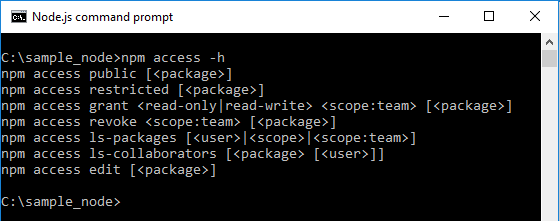
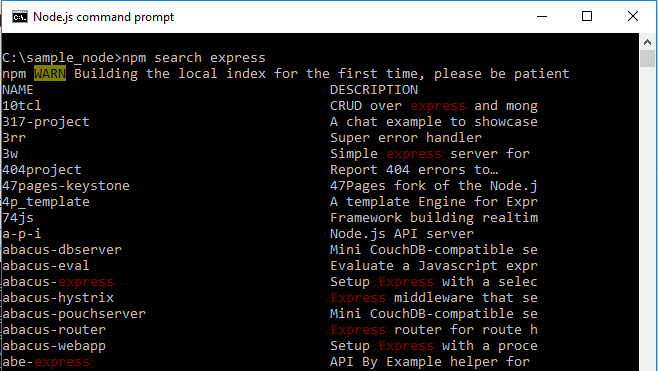
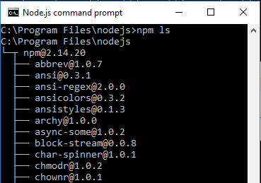
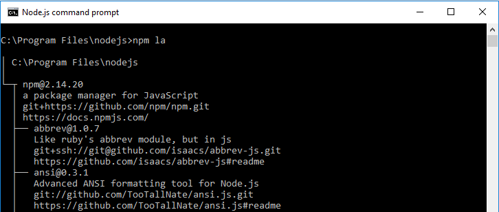
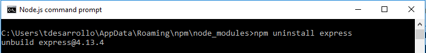
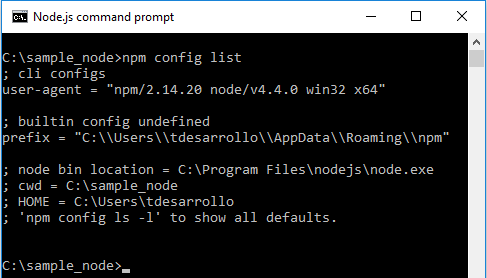

#Comandos con npm

Ejecutamos el command propmt de Node.js, y escribimos` > npm ` obtendremos el detalle de los comandos que podemos utilizar:
##Ejemplos
+ Obtenemos la ayuda rápida del comando especificado `> npm [commando] -h`

    

+ Buscar en el registro de "npm" un paquete o módulo `> npm search [paquete]`, en nuestro caso al ser la primera vez que realizamos la búsqueda se creará un índice local:

    
*Al no poner nada más nos mostrará todas las coincidencias que ha encontrado, tanto de paquetes como de descripciones.*

+ Obtener información de un módulo `> npm info [paquete]` obtendremos la descripción, versiones, autores, fechas de creación de las diferentes versiones, repositorios, usuarios..., es decir, obtenemos un array JSON completo.  

+ Listar los paquetes instalados en un directorio en formato árbol `> npm [ ls | la | ll | list]`:
	+ **"ls"** y **"list"**: muestra el nombre de los módulos.

    

	+ **"la"** y **"ll"**: muestra el nombre del módulo, su versión, una descripción, url del repositorio y del fichero README.md.

    
+ Eliminar módulo con `> npm [rm|uninstall] [paquete]`, tenemos un módulo descargado en "RUTA C:\App\Romaing" también tenemos la opción de indicar el nombre del paquete más la versión.

    
> NOTA:  Tendremos que estar en la carpeta / ruta de desarrollo que contiene el módulo para poder desinstalarlo.

+ Mostrar la configuración utilizada `> npm config list`

	

	Nos muestra la versión de "npm", de "node.js" el sistema operativo y su arquitectura. Ruta dónde por defecto dónde se instalarán los paquetes **"en caché"** que necesitemos así como los "nuevos" proyectos que vayamos creando, es decir, que se guardan como un nuevo paquete dentro de **"node_modules"** en **"..\AppData\Roaming\npm\node_modules"**.

+ ++Editar la configuración de "npm"++: mediante el comando `> npm config edit` nos abrirá el fichero de configuración del usuario en un editor, en nuestro caso con el bloc de notas. Mientras que con `> npm config edit --global` tendremos el fichero de configuración general.

##Referencias
[**"npm"** - Más comandos del lado del cliente](https://docs.npmjs.com/cli/npm)  

	
