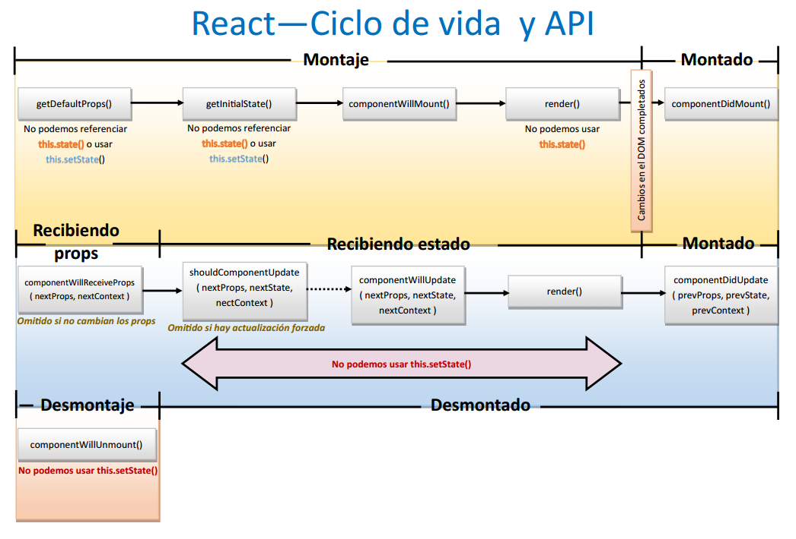

#React: ciclo de vida de un componente y sus características
##Ciclo de vida de un componente React


Al crear e interactuar con un componente React éste pasa por tres ciclos:

+ Montaje (mounting).

+ Actualización (updating).

+ Desmontaje (unmounting).  


En la documentación de la página oficial de React, separa métodos para la especificación de componentes y otros para el ciclo de vida:  

|Especificación|Montaje|Actualización|Desmontaje|
|:--------:|:--------:|:--------:|:--------:|
| render(*) 		| getInitialState | [componentWillReceiveProps][enlaceComponentwillreceiveprops] | [componentWillUnmount][enlaceUnmountingcomponentwillmount] |
| [getInitialState][enlaceGetinitialstate](*) | getDefaultProps| [shouldComponentUpdate][enlaceShouldcomponentupdate] |  |
| [getDefaultProps][enlaceGetdefaultprops](*) | [componentWillMount][enlaceComponentwillmount] | [componentWillUpdate][enlaceComponentwillupdate] |  |
| propTypes(*) 	| [render][enlaceRender] | [render][enlaceRender] |  |
| mixins(*) 		| [componentDidMount][enlaceComponentdidmount] | [componentDidUpdate][enlaceComponentdidupdate] |  |  
| statics(*) 		|  |  |  |
| displayName(*) |  |  |  |  

> (*) Métodos que podemos utilizar para la creación del componente.

> Aunque nosotros trataremos "dichas especificaciones" como pertenecientes al montaje del componente.

###Montaje

En esta fase creamos/montamos el componente **en el DOM virtual** pudiendo utilizar los siguientes métodos:

+ **[getInitialState][enlaceGetinitialstate],** se llama sólo al principio al montar el componente, tendrá el valor inicial de `this.state`.

+ **[getDefaultProps][enlaceGetdefaultprops],** invocado sólo una vez y se guarda en caché al crear el componente. Los valores se guardarán en `this.props`. No puede depender de ningún valor de `this.props` porque es invocado antes de la creación de cualquier instancia.

+ **[componentWillMount][enlaceComponentwillmount],** sólo se invoca una vez y antes de renderizar el componente. En el caso de que pongamos un valor de estado (`this.state`) dentro, no se producirá ninguna actualización.

+ **[render][enlaceRender],** nos devuelve el componente para visualizarlo, en caso de que no queramos mostrar nada, debe retornar "null" o "false". Requisitos a cumplir: 

	+ Siempre será un método requerido por los componentes. 

	+ Nunca debe modificar el estado del componente ni modificar el resultado cada vez que sea llamado.

	+ Prohibido leer / escribir directamente en el **[DOM][enlaceDOM]** o interactuar en el navegador (si ocurriera tal cosa, deberemos utilizar el método `componentDidMount`).

+ **[componentDidMount][enlaceComponentdidmount],** invocado una sóla vez y en el lado del cliente, será llamado después de la renderización. Aquí podremos acceder a las referencias (`refs`) de los componentes hijos ya que dicho método es llamado antes que el de los padres (paterns). También podemos integrar: componentes jQueryUI, boobstrap, llamadas Ajax, etc.

	> Podemos integrar dentro de un elemento react:

	>   + Sólo jQuery: animaciones...

	>   + Dentro de una misma página, tener de forma separada los componentes: react.js y el plugin de jQueryUI. La comunicación entre dichos componentes se efectuaría mediante un objeto compartido en la misma ventana del navegador.

	>   + Integrar un plugin jQueryUI como parte del "renderizado" de "React.js".
	NOTA: Para sincronizar el plugin de jQueryUI con el renderizado debemos tener claro que el componente "se lanza" una vez que ha sido: creado, renderizado y añadido al **[DOM][enlaceDOM].** Entonces mediante el método `componentDidMount` podremos renderizarlo junto con el componente react.


    Ahora el componente "montado" se muestra en nuestro navegador.


```javascript
import ReactDOM from 'react-dom';	//Paquete react-dom
import Footer from './Footer.jsx';	//React.Component
import Header from './Header.jsx';	//React.Component

let HelloWord = React.createClass({
    getDefaultProps: function () {
        console.log('Paso 1º. Ejecución de getDefaultProps');
        return {
     		value: 'valor por defecto'
        };
    },
    getInitialState: function () { 
        console.log('Paso 2º. Ejecución de getInitialState'); 
        return {};
    },
    componentWillMount: function () { 
    	console.log('Paso 3º. Ejecución de componentWillMount'); 
    },

    render: function () {

        console.log('Paso 4º. Ejecución de render');
        return (
            <div>
                <Header /> 						//componente React
                <h1>Ciclo de vida de ReactJS</h1> // etiqueta HTML + texto
                <Footer />						//componente React
            </div>
        );
    },
    componentDidMount: function () { 
        console.log('Paso 5º. Ejecución de componentDidMount'); 
    },
});

ReactDOM.render(<HelloWord />, document.getElementById('contenedor'));
```

Podemos poner sólamente el método `render` con etiquetas HTML y otros componentes de React pero todos ellos delimitados por un contenedor `<div>` para que sea posible la renderización del propio componente padre. En el caso de poner los métodos desordenados, se seguirán ejecutando en orden tal y como se muestran en el código anterior.


###Actualización.

Dicha fase sucede cuando se producen cambios en el estado o nuevas propiedades.

+ **[componentWillReceiveProps][enlaceComponentwillreceiveprops]**, sólo cuando el componente recibe nuevos "props". Utilizamos éste método para actualizar el estado del componente (`this.state`). Los valores anteriores de los "props" son accesibles mediante el método `this.props` porque aún no se han actualizado. Dicho método recibe como parámetros los valores de los "props" a actualizar. Este método no es llamado cuando hay un cambio de estado.

+ **[shouldComponentUpdate][enlaceShouldcomponentupdate]**, se llama al recibir los nuevos "props" / "estados". El valor por defecto devuelto es `true` pero podemos sobreescribirlo y cambiarlo a `false` en el caso de que la actualización de los "props"/"estados" no implice la actualización del componente, provocando a su vez que no se llame a los métodos: `render`, `componentWillUpdate`, `componentDidUpdate` hasta el próximo cambio. Dentro de este método podemos efectuar comparaciones entre los cambios pudiendo decidir si actualizamos o no por lo que la ventaja que presenta es la de un mejor rendimiento y aprovechamiento de los recursos.

+ **[componentWillUpdate][enlaceComponentwillupdate]**, se invoca al recibir los nuevos "props"/"estados". No podremos utilizar `this.setState` en caso de que queramos cambiar el estado ya que se produce un cambio en los "props" por tanto deberemos utilizar el método `componentWillReceiveProps`.

+ **[render][enlaceRender]**, realiza lo mismo que hemos indicado en la fase de montaje. Creación del componente como tal.

+ **[componentDidUpdate][enlaceComponentdidupdate]**, método utilizado para realizar operaciones en el DOM una vez que el componente ya está actualizado.


###Desmontaje.
Es la última fase donde el componente se desmonta, el método utilizado es:

+ **[componentWillUnmount][enlaceUnmountingcomponentwillmount]**, llamaremos al método antes de que el componente sea borrado del DOM, pudiendo eliminar elementos creados por el método `componentDidMount`.

##Especificaciones de componentes
Cuando creamos la clase de un componente mediante `React.createClass()` deberemos proporcionar un objeto de especificaciones el cual contendrá un método `render` pudiendo también tener otros métodos (o no) correspondientes al ciclo de vida descritos anteriormente.

> Tenemos la posibilidad para utilizar clases JavaScript como clases de componentes, pudiendo dichas clases implementar varios métodos con diferencias. **[Más información sobre las clases en ECMAScript6](https://facebook.github.io/react/docs/reusable-components.html#es6-classes)**.

En el caso de que un componente necesitara modificar alguno de sus atributos durante su ciclo de vida, dicho atributo debe formar parte de su estado (`state`), en caso contrario lo será como propiedad (`props`).

###Props (propiedades)

Éstos son los atributos que configurarán a nuestro componente, recibidos normalmente al instanciarlo (o crearlo). Un componente no puede cambiar por sí mismo sus propias propiedades (`props`).

> Tanto el `state` como el `props` pueden ponerse opcionalmente e indicar que contengan un valor por defecto.

####[propTypes][enlaceProptypes]
Es un objeto que permite establecer una serie de validaciones que se estableceran sobre las propiedades ("props") que reciba el componente en el momento de ser creado. Utilizando `React.PropTypes` podemos garantizar el uso correcto de los componentes **[mediante validadores][enlaceValidadores]** que nos permita asegurar que los datos que reciba el componente sean los correctos.  

Si tenemos un componente que pase los datos de usuario

```xml
<BookEditor book={theBook} onSave={saveBook} onDelete={deleteBook} />
```

En el siguiente ejemplo, nuestro componente recibirá a través del objeto `props` los datos actuales del usuario y las funciones que deberá invocar para por ejemplo guardar / borrar dicho usuario.

```javascript

let BookEditor = React.createClass({
	propTypes:{
    	book: React.PropTypes.shape({
        	id: React.PropTypes.number.isRequired,
       	 name: React.PropTypes.string.isRequired,
      	  role: React.PropTypes.oneOf(['general','science','reference'])
        }).isRequired,
        onSave: React.PropTypes.func.isRequired,
        onDelete: React.PropTypes.func.isRequired
    }
});

```


Por razones de rendimiento `propTypes` sólo se mostrará en la consola de JavaScript en modo desarrollo ya que si estamos en modo producción React.js desactiva la validación de propiedades mostrándo únicamente un `warning` en la consola de desarrollo.

Podemos declarar en nuestro componente `React.createClass` **[los diferentes validadores, tipos, opciones, etc][enlaceValidadores]** dentro de `propTypes:{ }` tal y como se ha mostrado en el ejemplo anterior.

Cuando definimos un componente React, sólo es necesario definir su método `render` sin recibir ningún tipo de parámetro (cuando lo creamos / montamos siguiendo **[el ciclo de vida][enlaceCiclodevida]**) y desconocemos qué propiedades deberemos pasarle al componente por lo que es más productivo que en la definición de la validación de las propiedades (`propTypes`) nos aparezcan.

En el caso de que tengamos **[un hijo único][enlaceHijounico]** dentro de nuestro componente indicado dentro del `propTypes` mediante `children: React.PropTypes.element.isRequired` indicamos que sólo podemos pasarle al componente padre un hijo.


######[Valor por defecto `props`][enlaceDefaultpropvalues]

React nos deje definir valores por defecto para el `props` de manera declarativa. Cuando utilizamos un `return { }`y dentro indicamos cualquier cosa, por ejemplo un valor, éste se almacenará en el caché del navegador asegurando que `this.props.value` dispondrá de un valor a no ser que se especificara en el componente padre.


#####Transferencia de propiedades: acceso directo

Un tipo de componente React que extienda un elemento HTML básico de una forma simple es cuando queremos copiar algunos atributos HTML y los queremos pasar al elemento HTML directamente subyacente, pudiendo utilizar la propagaciñón JSX.


####[Mixins][enlaceMixins]

El uso de componentes es la mejor forma para reutilizar código en React y extender clases u objetos, añadiéndoles la funcionalidad de otros, es decir, que varios componentes podrían compartir funcionalidades en común (**[cross-cutting concerns][enlaceCrosscuttingconcern]**) así que mediante `mixins` podemos reutilizar código y dar dicha funcionalidad a nuestros componentes.


Los mixins nos ayudan a empaquetar funciones reutilizables para después añadirlas a otross componentes, pero teniendo cuidado de que dichos mixins "tengan que ver" con el propio componente, accediendo a sus `props` ,`state` o `this`.


En el siguiente ejemplo podemos ver que creamos un mixin llamado "MyLogo" que tiene un método que se utilizará para escribir un texto por consola, al crear la clase "MyComponente" como componente de React, realizamos la llamada a "MyLogo" para que muestre por consola un mensaje, después monta el componente y después lo renderiza en el navegador por tanto, en la consola de desarrollo podremos ver que primero se mostrará el mensaje del mixin y después el del componente.

```javascript

// las variables deben empezar con mayúscula
// para que React lo reconozca como tal y no como etiqueta HTML

let MyLogo = {
	componentDidMount: function(){
    console.log('Logo mixin montado!')
    }
};

let MyComponente = React.createClass({
	mixins:[MyLogo],
    // podemos indicar más mixins
	// el orden seguido es el que está introducid
    //mixins:[MyLogo, OtroLogo, MasLogo],
 	render: function(){
		return <div/>
  	},
    componentDidMount: function(){
    	console.log('myComponente montado');
    },
});

ReactDOM.render(<MyComponente />, document.getElementById('contenedor'));
```

> Por desgracia ES6 fue lanzado sin soporte para `mixins`, entonces si utilizamos React al crear clases con ECMAScript 2015 (ES6) deberíamos trabajar sin `mixins`.

####[statics][enlaceStatics]
Dicho objeto permite definir métodos estáticos que pueden ser llamados desde un componente con clase. Esto significa que podemos lanzar dichos métodos antes que de las instancias del componente sean creadas y que éstos no tengan acceso a los `props` y `state` de nuestros componentes.

####[displayName][enlaceDisplayname]
Objeto utilizado para el debug de mensajes, en JSX se pone este valor automáticamente. JSX definirá la clase `displayName` para la asignación de una variable en el caso de que `displayName` no sea definida.

Desde la página oficial nos indican utilizar `BABEL REPL` para probar JSX y ver el resultado también en JavaScript nativo, además también se dispone del convertidor de etiquetas/código HTML a JSX **[en este enlace][enlaceHtmltojsx].**

>Las expresiones en JSX siempre evalúan a un elemento React.

##Estados (State)
Es la representación del componente en cualquier momento dentro de su ciclo de vida. El `state` del componente tendrá un valor por defecto pero modificable cuando lo indiquemos. La definición del `state` siempre es opcional ya que el mismo componente puede definir su propio `state`. El uso del `state` aumenta la complejidad y reduce la previsibilidad del componente por tanto debemos evitar disponer de muchos componentes con estados y más en aplicaciones de gran tamaño.

Los métodos utilizados para informar al componente que sus datos han cambiado:
+ `setState()` recibe un objeto JavaScript combinando los nuevos datos y renderizará el componente.
+ `replaceState` elimina los datos existentes

##[Diferencias entre `props` y `state`][enlaceDiferencias]
Entender ambos de forma conceptual es complicado ya que tienen los mismos términos abstractos así como mismos valores.
####Contexto
Cada componente traduce los datos en HTML los cuales son los `props` y `state` que en conjunto que conformarán el HTML resultante después de la comparación de diferencias entre el DOM real y el virtual. Además de ser la entrada de datos para el renderizado (`render()`) de cualquier componente.

####Puntos en común
¿Dónde se superponen `props` y `state`?
- Los dos son objetos JavaScript.
- Los `props` y los cambios de estado desencadenan una actualización del renderizado.
- Están determinados, sólo generará una salida de datos por cada `props`+`state` indicado. Si se obtienen distintos datos para la combinación de ambos entonces no será correcto el código empleado para ello.

En el caso de que queramos modificar un atributo de un componente durante el ciclo de vida, éste debe formar parte de su estado, en caso contrario sólo será un `props` del componente ya que no cambiará con el tiempo.
#####props
Son las propiedades de la configuración de un componente, recibidos desde el componente padre hacía un componente hijo. Un componente no puede cambiar sus propiedades `props` pero es responsable de establecer las propiedades de sus componentes hijos.

#####state
Establecido el valor por defecto al montar el componente, después dicho valor será actualizado por los eventos generados al interactuar el usuario con el/los componente/-s. El componente gestiona su propio `state` internamente pero se puede indicar un estado inicial. 

#####Cambios
|  | `props` | `state` |
|--------|:--------:|:---------:|
|¿Podemos obtener el valor inicial del componente padre?| Sí | Sí |
|¿Puede ser modificado por el componente padre?| Sí | No |
|¿Podemos establecer valores por defecto dentro de un componente?(*)| Sí | Sí |
|¿Podemos cambiar internamente un componente?| No | Sí |
|¿Podemos establecer un valor inicial para los componentes hijos?| Sí | Sí |
|¿Podemos realizar cambios en los componentes hijos?| Sí | No |

>(*) Los valores iniciales que tengan los `props` así como los `state` de un componente pueden ser sobreescritos por los valores por defecto definidos dentro del componente padre.

####¿Debe el componente tener estado (`state`)?
Siempre es opcional. El problema es que con los `state` aumenta la complejidad del componente por lo que es preferible que el componente esté sin `state`. Hay que evitar disponer de muchos componentes con `state`.

####Estados de los componentes
+ **"sin estado"**, el componente sólo tendrá propiedades (`props`).
+ **"con estado"**, el componente tiene `props` y `state`. También se les llama "administradores de estado", los cuales se encargarían de la comunicación cliente-servidor, procesamiento de datos y responder a los eventos del usuario. Además, se recomienda un número moderado de dichos componentes.
+ Más información sobre los estados **[en la página oficial de react.js][enlaceEstados1]** o en el foro **"[react.js google groups][enlaceEstados2]"**.

##[Funciones sin estado][enlaceFuncionesinestado]

Tenemos dos formas para definir clases en React mediante JavaScript:

+ Syntaxis Función sin estado.
+ Nueva flecha ES6.  


Haremos las definiciones en el caso de que dichos componentes no dispongan de:
- métodos para guardar su estado interno.
- instancias de respaldo.
- los métodos de ciclo de vida de los componentes.


Es posible especificar su `propTypes` y su `defaultProps`. Pero no podemos guardarnos una instancia de dichas funciones ni tampoco adjuntar una referencia a un componente con una función sin estado. En el caso de que nosotros quisiéramos encontrar el nodo DOM de un componente sin estado, debemos envolver dicho componente dentro de otro "que sí tenga" estado.


> A partir de la versión 15, los componentes sin estado pueden devolver el valor "null" en el caso de que no queramos representar o mostrar nada.


##Referencias
+ [Ciclo de vida de un componente React](http://vensign.com/reactjs-ciclo-de-vida-de-un-componente/).
+ [Facebook React - Lifecycle](https://facebook.github.io/react/docs/component-specs.html#lifecycle-methods).
+ [React - objeto propTypes](http://blog.koalite.com/2015/01/especificacion-de-tipos-en-reactjs-con-proptypes/).
+ [Ejemplos de componentes React.js: animaciones, iconos, imágenes...](https://js.coach/react).
+ [React.js - Listado de cambios](https://github.com/facebook/react/blob/master/CHANGELOG.md).
+ [Mixins en React.js](http://blog.koalite.com/2015/07/un-mixin-para-carga-asincrona-de-datos-en-reactjs/).
+ [React sobre ES6](https://babeljs.io/blog/2015/06/07/react-on-es6-plus).


<!-- Referencias ocultas -->
[enlaceDOM]:http://librosweb.es/libro/ajax/capitulo_4.html
[enlaceProptypes]:https://facebook.github.io/react/docs/component-specs.html#proptypes
[enlaceValidadores]:https://facebook.github.io/react/docs/reusable-components.html#prop-validation
[enlaceCiclodevida]:https://facebook.github.io/react/docs/component-specs.html#lifecycle-methods
[enlaceHijounico]:https://facebook.github.io/react/docs/reusable-components.html#single-child
[enlaceGetinitialstate]:https://facebook.github.io/react/docs/component-specs.html#getinitialstate
[enlaceGetdefaultprops]:https://facebook.github.io/react/docs/component-specs.html#getdefaultprops
[enlaceComponentwillmount]:https://facebook.github.io/react/docs/component-specs.html#mounting-componentwillmount
[enlaceRender]:https://facebook.github.io/react/docs/component-specs.html#render
[enlaceComponentdidmount]:https://facebook.github.io/react/docs/component-specs.html#mounting-componentdidmount
[enlaceComponentwillreceiveprops]:https://facebook.github.io/react/docs/component-specs.html#updating-componentwillreceiveprops
[enlaceShouldcomponentupdate]:https://facebook.github.io/react/docs/component-specs.html#updating-shouldcomponentupdate
[enlaceComponentwillupdate]:https://facebook.github.io/react/docs/component-specs.html#updating-componentwillupdate
[enlaceComponentdidupdate]:https://facebook.github.io/react/docs/component-specs.html#updating-componentdidupdate
[enlaceUnmountingcomponentwillmount]:https://facebook.github.io/react/docs/component-specs.html#unmounting-componentwillunmount
[enlaceMixins]:https://facebook.github.io/react/docs/reusable-components.html#mixins 
[enlaceDefaultpropvalues]:https://facebook.github.io/react/docs/reusable-components.html#default-prop-values
[enlaceCrosscuttingconcern]:https://en.wikipedia.org/wiki/Cross-cutting_concern
[enlaceFuncionesinestado]:https://facebook.github.io/react/docs/reusable-components.html#stateless-functions
[enlaceStatics]:https://facebook.github.io/react/docs/component-specs.html#statics
[enlaceDisplayname]:https://facebook.github.io/react/docs/component-specs.html#displayname
[enlaceHtmltojsx]:https://facebook.github.io/react/html-jsx.html
[enlaceDiferencias]:https://github.com/uberVU/react-guide/blob/master/props-vs-state.md
[enlaceEstados1]:http://facebook.github.io/react/docs/thinking-in-react.html#step-4-identify-where-your-state-should-live
[enlaceEstados2]:https://groups.google.com/forum/#!topic/reactjs/hAldztPzQgI
