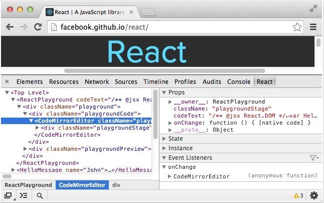
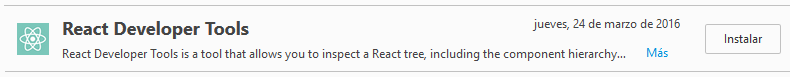
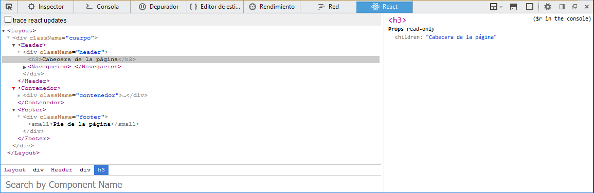

#React
##Extensiones/plugins para navegadores web

###Instalando React Developer Tools (extensión/plugin)

####En Google Chrome

Para poder realizar el ***"debug"*** tendremos que tener instalando en el navegador Google Chrome como **"herramienta para desarrolladores"** como **[extension][enlace1]** y aquí tenemos la **[información sobre dicha extensión][enlace2]** en a la página oficial de React.js explicando el funcionamiento de la versión estable

>**Debugger:** es un programa que se utiliza para testear y "depurar" otros programas. El código es examinado 
alternativamente mientras está funcionando mediante un simulador de instrucciones *(fuente: Wikipedia)*.  

Esta extensión complementa las herramientas de desarrollo de Chrome para poder visualizar los archivos JavaScript XML.  

####En Mozilla Firefox

Para aquellos usuarios de Mozilla Firefox también está disponible como complemento:

  

Donde podremos navegar por los diferentes componentes y subniveles dentro del componente principal:

  

##Referencias
+ [Página oficial de react.js.](https://facebook.github.io/react/index.html)
+ [Lista completa de cambios en la versión 15.0.](https://facebook.github.io/react/blog/2016/04/07/react-v15.html)

<!-- Referencias  ocultas -->
[enlace1]:https://chrome.google.com/webstore/detail/react-developer-tools/fmkadmapgofadopljbjfkapdkoienihi
[enlace2]:http://facebook.github.io/react/blog/2015/09/02/new-react-developer-tools.html