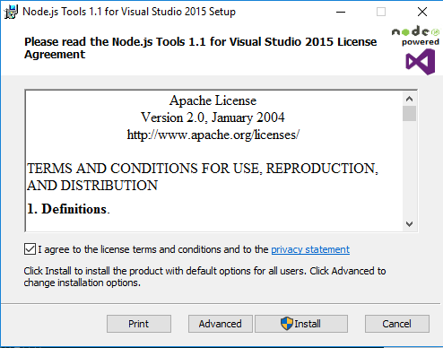
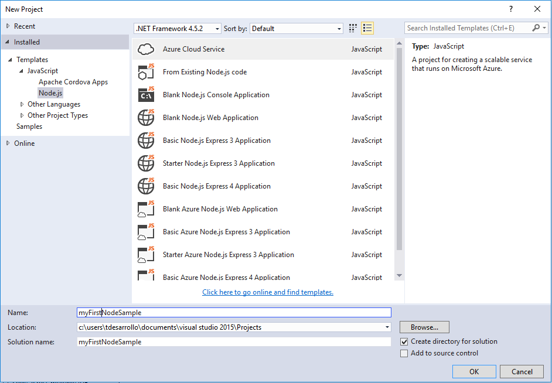

##Instalar Node.js Tools 1.1 en Visutal Studio 2015

Desde la página de Microsoft nos habremos descargado e instalado previamente la **versión Community 2015** de Visual Studio Express, procederemos a descargarnos e instalarnos el **[plugin][enlacePlugin]** en nuestra máquina local.

Nos descargaremos el archivo correspondiente MSI de instalación de paquetes de Windows. Al ejecutarlo nos aparecerá el asistente indicándonos los pasos que deberemos seguir para la instalación satisfactoria:  

Al finalizar la instalación, ejecutaremos Visual Studio, tanto si queremos crear un nuevo proyecto o sitio web, ++podremos ver que tenemos como instalado++, la plantilla para JavaScript, más concretamente **"Node.js"**:

# Ventajas que ofrece dicho plugin

Las ventajas de que dispondremos serán:
+ Dispone de plantillas de proyecto integradas, pudiendo importar código en Node.js o bien empezar de cero.  

+ Integración con **"npm"**. Búsqueda, actualización, dependencias e instalación de paquetes desde la propia interfaz de Visual Studio.

+ Funciones de autocompletado de escritura de código.

+ Depuración de forma local y remota, uso de puntos de ruptura, notificaciones y excepciones.

+ Ventanas interactivas para ver el resultado del código introducido.

+ Generación de informes de perfiles a distintos niveles de la estructura de la aplicación y los datos de ejecución del programa.

+ Integración con [TypeScript][enlaceTypeScript], se compila con JavaScript. Agregando tipos, clases y módulos que permita escribir código más fácil de mantener. **"Nodee.js Tools for Visual Studio"** ofrece compatibilidad con TypeScript.

+ Dispondremos de **"Node.js"**, **"io.js"**, **"JavaScript"**, **"TypeScript"**, **"HTML"**, **"CSS"** y soporte para **"JSON"**.

***

**Referencias:**  
+ Obtener [NodeJS Tool for VS](https://www.visualstudio.com/es-es/features/node-js-vs.aspx) .  
+ Código fuente y documentación en [Microsoft GitHub Node.js](https://github.com/Microsoft/nodejstools) .
+ Página web de [TypeScript ](http://www.typescriptlang.org/) .

<!-- Referencias a enlaces ocultos -->
[enlacePlugin]:https://www.visualstudio.com/en-us/features/node-js-vs.aspx
[enlaceTypeScript]:http://www.typescriptlang.org/